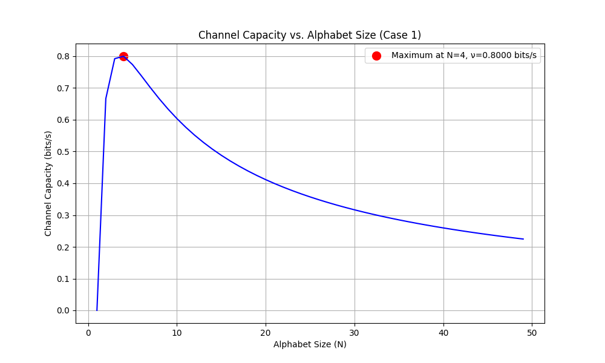
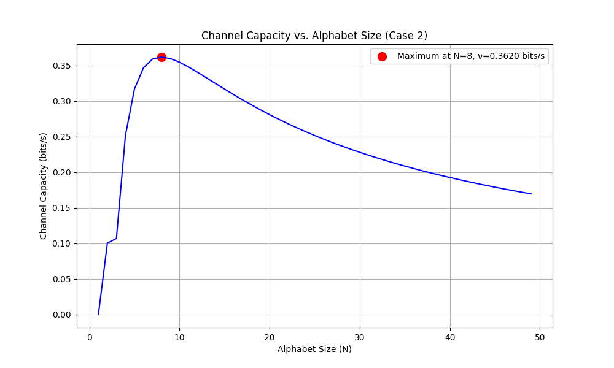
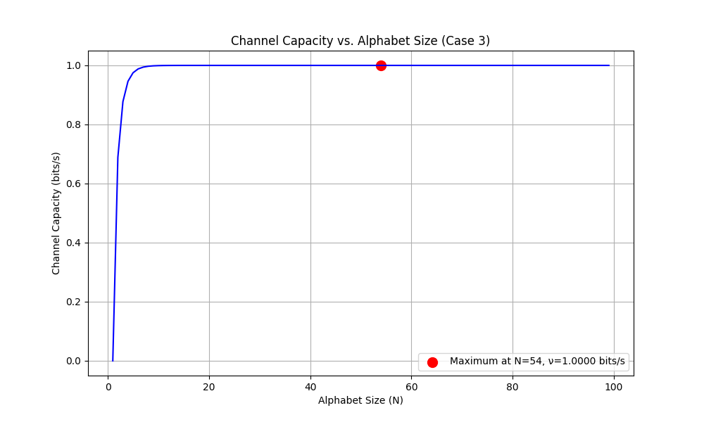

# НИЯУ МИФИ. Домашняя работа №1. Краснопольский Иван, Б21-525. 2025

## Используемая теория

Согласно теории информации, пропускная способность канала без шума может быть определена по формуле:

$$\nu = \lim_{t \to \infty}\left(\frac{\log_2(N(t))}{t}\right)$$

где $N(t)$ — количество возможных последовательностей символов, которое можно передать за время $t$.

Для оценки пропускной способности скрытого канала в сетях пакетной передачи данных используется формула:

$$\nu = \max_{X}\left\{\frac{I(X,Y)}{\tau}\right\}$$

где $\tau$ — среднее время передачи одного пакета, а $I(X,Y)$ — взаимная информация случайных величин $X$ и $Y$,
описывающих входные и выходные характеристики скрытого канала соответственно.

Взаимная информация вычисляется по формуле:

$$I(X,Y) = H(Y) - H(Y|X)$$

где $H(Y)$ — энтропия случайной величины $Y$, а $H(Y|X)$ — условная энтропия $Y$ относительно $X$.

## Реализация расчетов

Для решения поставленной задачи был разработан алгоритм расчета пропускной способности канала для различных
значений $N$.
Реализация выполнена на языке Python с использованием библиотек NumPy и Matplotlib.

Для каждого случая расчет проводился по следующему алгоритму:

1. Определение распределения вероятностей входных символов $p(i)$
2. Создание матрицы переходных вероятностей (для случая с ошибками)
3. Расчет энтропии $H(x)$ или взаимной информации $I(X,Y)$
4. Расчет среднего времени передачи символа $\tau$
5. Вычисление пропускной способности как $\nu=\frac{I(X,Y)}{\tau}$
6. Поиск $N$, при котором ν максимальна
7. Построение графика зависимости $\nu$ от $N$

### Случай 1: Равномерное распределение, канал без ошибок

#### Характеристики:

- Вероятности входных символов одинаковы и равны $\frac{1}{N}$
- Канал без ошибок (символы передаются с вероятностью, равной 1)

Для данного случая:

- Энтропия $H(X) = \log_2(N)$
- Среднее время передачи $\tau = \frac{N+1}{2}$
- Пропускная способность $\nu = \frac{H(X)}{\tau} = \frac{2\log_2(N)}{N+1}$

#### Код:

```python
import matplotlib.pyplot as plt
import numpy as np


def calculate_channel_capacity(alphabet_size):
    entropy = np.log2(alphabet_size)
    avg_transmission_time = (alphabet_size + 1) / 2
    return entropy / avg_transmission_time


def find_optimal_alphabet_size(max_size=100):
    max_capacity = 0
    optimal_size = 0

    for size in range(1, max_size + 1):
        capacity = calculate_channel_capacity(size)
        if capacity > max_capacity:
            max_capacity = capacity
            optimal_size = size

    return optimal_size, max_capacity


def plot_capacity_vs_alphabet_size(optimal_size, max_capacity):
    size_values = range(1, 50)
    capacities = [calculate_channel_capacity(size) for size in size_values]

    plt.figure(figsize=(10, 6))
    plt.plot(size_values, capacities, "b-")
    plt.scatter(
        optimal_size,
        max_capacity,
        color="red",
        s=100,
        label=f"Maximum at N={optimal_size}, ν={max_capacity:.4f} bits/s",
    )
    plt.xlabel("Alphabet Size (N)")
    plt.ylabel("Channel Capacity (bits/s)")
    plt.title("Channel Capacity vs. Alphabet Size (Case 1)")
    plt.grid(True)
    plt.legend()
    plt.savefig("case1_capacity.png")
    plt.show()


def main():
    optimal_size, max_capacity = find_optimal_alphabet_size()

    print(f"Optimal alphabet size: {optimal_size}")
    print(f"Maximum channel capacity: {max_capacity:.4f} bits/s")

    plot_capacity_vs_alphabet_size(optimal_size, max_capacity)


if __name__ == "__main__":
    main()
```

#### Результаты:

- Оптимальный размер алфавита: **N = 4**
- Максимальная пропускная способность: **0.8000 бит/с**



График зависимости пропускной способности от размера алфавита показывает, что $\nu$ быстро растет при малых $N$,
достигает максимума при $N = 4$, а затем монотонно убывает с увеличением $N$.

### Случай 2: Равномерное распределение, канал с ошибками

#### Характеристики:

- Вероятности входных символов одинаковы и равны $\frac{1}{N}$
- Канал с ошибками:
    * $p(i-1|i) = 0.2$, $p(i|i) = 0.6$, $p(i+1|i) = 0.2$, для $i = 2,...,N-1$
    * $p(N|1) = 0.2$, $p(1|1) = 0.6$, $p(2|1) = 0.2$
    * $p(N-1|N) = 0.2$, $p(N|N) = 0.6$, $p(1|N) = 0.2$

В данном случае:

- Взаимная информация $I(X,Y) = H(Y) - H(Y|X)$
- Среднее время передачи $\tau = \frac{N+1}{2}$ (как и в случае 1)

#### Код:

```python
import matplotlib.pyplot as plt
import numpy as np


def calculate_channel_capacity(alphabet_size):
    p_input = np.ones(alphabet_size) / alphabet_size

    p_output_given_input = np.zeros((alphabet_size, alphabet_size))

    for i in range(alphabet_size):
        if alphabet_size == 1:
            p_output_given_input[0][0] = 1.0
            continue

        p_output_given_input[i][i] = 0.6

        if i == 0:
            p_output_given_input[alphabet_size - 1][i] = 0.2
            p_output_given_input[1][i] = 0.2
        elif i == alphabet_size - 1:
            p_output_given_input[i - 1][i] = 0.2
            p_output_given_input[0][i] = 0.2
        else:
            p_output_given_input[i - 1][i] = 0.2
            p_output_given_input[i + 1][i] = 0.2

    p_output = np.zeros(alphabet_size)
    for j in range(alphabet_size):
        for i in range(alphabet_size):
            p_output[j] += p_input[i] * p_output_given_input[j][i]

    H_Y = 0
    for j in range(alphabet_size):
        if p_output[j] > 0:
            H_Y -= p_output[j] * np.log2(p_output[j])

    H_Y_given_X = 0
    for i in range(alphabet_size):
        for j in range(alphabet_size):
            if p_output_given_input[j][i] > 0:
                H_Y_given_X -= (
                        p_input[i]
                        * p_output_given_input[j][i]
                        * np.log2(p_output_given_input[j][i])
                )

    mutual_information = H_Y - H_Y_given_X
    avg_transmission_time = (alphabet_size + 1) / 2

    return mutual_information / avg_transmission_time


def find_optimal_alphabet_size(max_size=100):
    max_capacity = 0
    optimal_size = 0

    for size in range(1, max_size + 1):
        capacity = calculate_channel_capacity(size)
        if capacity > max_capacity:
            max_capacity = capacity
            optimal_size = size

    return optimal_size, max_capacity


def plot_capacity_vs_alphabet_size(optimal_size, max_capacity):
    size_values = range(1, 50)
    capacities = [calculate_channel_capacity(size) for size in size_values]

    plt.figure(figsize=(10, 6))
    plt.plot(size_values, capacities, "b-")
    plt.scatter(
        optimal_size,
        max_capacity,
        color="red",
        s=100,
        label=f"Maximum at N={optimal_size}, ν={max_capacity:.4f} bits/s",
    )
    plt.xlabel("Alphabet Size (N)")
    plt.ylabel("Channel Capacity (bits/s)")
    plt.title("Channel Capacity vs. Alphabet Size (Case 2)")
    plt.grid(True)
    plt.legend()
    plt.savefig("case2_capacity.png")
    plt.show()


def main():
    optimal_size, max_capacity = find_optimal_alphabet_size()

    print(f"Optimal alphabet size: {optimal_size}")
    print(f"Maximum channel capacity: {max_capacity:.4f} bits/s")

    plot_capacity_vs_alphabet_size(optimal_size, max_capacity)


if __name__ == "__main__":
    main()
```

#### Результаты:

- Оптимальный размер алфавита: **N = 8**
- Максимальная пропускная способность: **0.3620 бит/с**



В этом случае наблюдается снижение максимальной пропускной способности по сравнению со случаем 1 (0.3620 против 0.8000
бит/с) из-за наличия ошибок в канале. Оптимальный размер алфавита при этом увеличивается с 4 до 8.

### Случай 3: Неравномерное распределение, канал без ошибок

#### Характеристики:

- Вероятности входных символов равны $p(i) = \frac{1}{2^i}$
- Канал без ошибок (символы передаются с вероятностью, равной 1)

В данном случае:

- Энтропия $H(X)$ зависит от неравномерного распределения вероятностей
- Среднее время передачи $\tau = \sum_i(p(i) \cdot i)$

#### Код:

```python
import matplotlib.pyplot as plt
import numpy as np


def calculate_channel_capacity(alphabet_size):
    p_unnorm = np.array([1 / (2 ** i) for i in range(1, alphabet_size + 1)])

    normalization_factor = np.sum(p_unnorm)
    p = p_unnorm / normalization_factor

    entropy = -np.sum(p * np.log2(p, where=p > 0))

    indices = np.arange(1, alphabet_size + 1)
    avg_transmission_time = np.sum(p * indices)

    capacity = entropy / avg_transmission_time

    return capacity


def find_optimal_alphabet_size(max_size=100):
    max_capacity = 0
    optimal_size = 0

    for size in range(1, max_size + 1):
        capacity = calculate_channel_capacity(size)
        print(capacity)
        if capacity > max_capacity:
            max_capacity = capacity
            optimal_size = size

    return optimal_size, max_capacity


def plot_capacity_vs_alphabet_size(optimal_size, max_capacity):
    size_values = range(1, 100)
    capacities = [calculate_channel_capacity(size) for size in size_values]

    plt.figure(figsize=(10, 6))
    plt.plot(size_values, capacities, "b-")
    plt.scatter(
        optimal_size,
        max_capacity,
        color="red",
        s=100,
        label=f"Maximum at N={optimal_size}, ν={max_capacity:.4f} bits/s",
    )
    plt.xlabel("Alphabet Size (N)")
    plt.ylabel("Channel Capacity (bits/s)")
    plt.title("Channel Capacity vs. Alphabet Size (Case 3)")
    plt.grid(True)
    plt.legend()
    plt.savefig("case3_capacity.png")
    plt.show()


def main():
    optimal_size, max_capacity = find_optimal_alphabet_size()

    print(f"Optimal alphabet size: {optimal_size}")
    print(f"Maximum channel capacity: {max_capacity:.4f} bits/s")

    plot_capacity_vs_alphabet_size(optimal_size, max_capacity)


if __name__ == "__main__":
    main()
```

#### Результаты:

- Оптимальный размер алфавита: **N = 54**
- Максимальная пропускная способность: **1.0000 бит/с**



График зависимости пропускной способности от $N$ показывает быстрый рост до значения около 1 бит/с, после чего
наблюдается
плато с очень небольшим приростом при увеличении $N$. Максимум достигается при $N=54$.

## Сравнение результатов

1. Наличие ошибок (случай 2) приводит к существенному снижению пропускной способности канала по сравнению с передачей
   без ошибок (случай 1), оптимальный размер алфавита при этом увеличивается.
2. Неравномерное распределение вероятностей с предпочтением символов с меньшим временем передачи (случай 3) позволяет
   достичь более высокой пропускной способности по сравнению с равномерным распределением (случай 1).
3. Оптимальный размер алфавита в случае 3 значительно больше, чем в случаях 1 и 2, так как добавление редко используемых
   символов с большими индексами несущественно увеличивает среднее время передачи.
4. Наибольшая пропускная способность достигается в случае 3, что демонстрирует эффективность неравномерного кодирования,
   когда более частые символы кодируются более короткими кодами.
