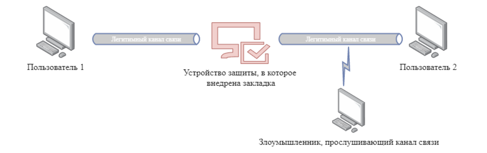
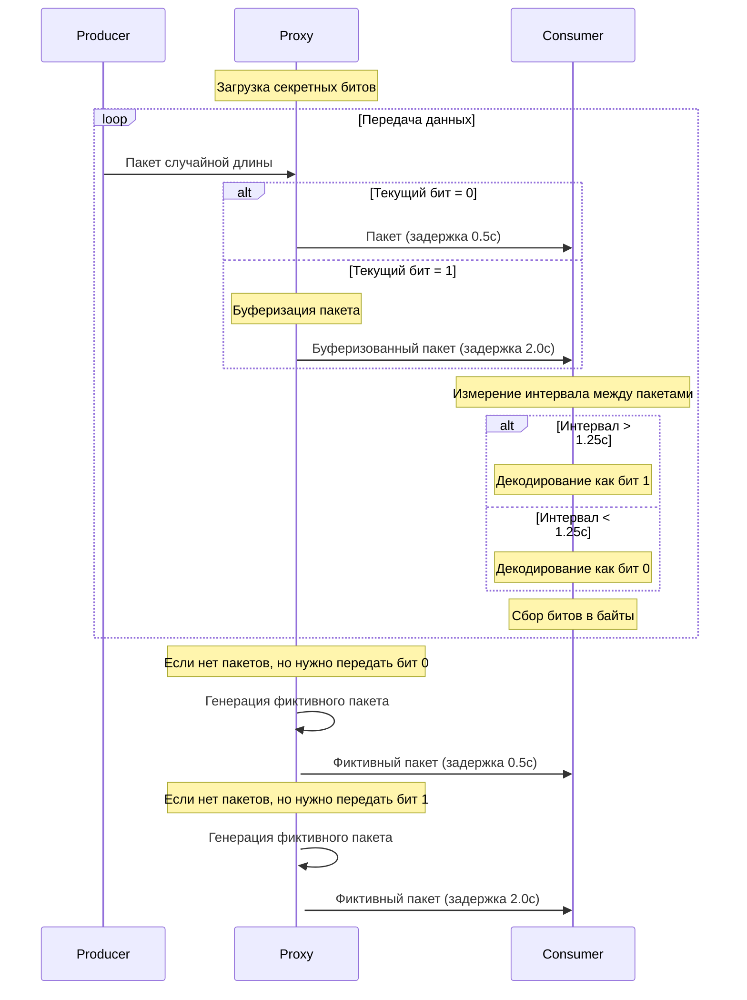

# НИЯУ МИФИ. Лабораторная работа №1. Краснопольский Иван, Б21-525. 2025

## Вариант 8

- Модель штатной передачи информации №4: пакеты случайной длины передаются в случайные моменты времени
- Скрытый канал №8: скрытый канал, основанный на изменении длин межпакетных интервалов
- Возможности закладки: буферизация трафика, генерация фиктивного трафика

## Разработка стенда

Стенд имитирует информационное взаимодействие двух пользователь по разрешенному каналу связи, который контролируется
устройством защиты. Пакеты случайной длины передаются между пользователями в случайные моменты времени.



В устройство защиты внедрена закладка, реализующая скрытый канал, основанный на изменении длин межпакетных интервалов.
Измеряется время между приходами двух последовательных пакетов. Информация кодируется в значениях длин межпакетных
интервалов. Выбирается пороговое значение, все значения ниже которого соответствуют «0», выше — «1».


В случае, если необходимо передать «0», но при этом отсутствуют пакеты в сети, устройство защиты генерирует фиктивный
трафик с соответствующей задержкой. Если же необходимо передать «1», но пакеты в сети передаются слишком часто,
устройство защиты буферизует пакеты и имитирует необходимую задержку.



## Тестирование стенда

### Секретное сообщение

```text
Attack at dawn\n

```

### Запуск consumer

```bash
python lab1/consumer.py
```

[Логи сервиса consumer](#consumer)

### Запуск proxy

```bash
python lab1/proxy.py
```

[Логи сервиса proxy](#proxy)

### Запуск producer

```bash
python lab1/producer.py
```

[Логи сервиса producer](#producer)

### Результат работы

```text
Attack at dawn\n
Attack at dawn\n
Attack at...
```

## Заключение

В ходе лабораторной работы был разработан стенд, содержащий сервисы producer, proxy и consumer, имитирующий
информационное взаимодействие двух пользователь по разрешенному каналу связи, который контролируется устройством защиты.

Сервис proxy реализует скрытый канал связи, основанный на изменении длин межпакетных интервалов. Информация кодируется в
значениях длин межпакетных интервалов, злоумышленник является отдельным модулем в рамках сервиса consumer.

Тестирование стенда продемонстрировало работу скрытого канала связи и успешную передачу секретного сообщения циклическим
образом.

## Логи

### Producer

<details>
    <summary>Логи сервиса producer</summary>

```text
2025-02-26 18:58:53 - Producer - Connected to proxy server
2025-02-26 18:58:53 - Producer - Sent packet: b'SRQYOZROCMCYZBWKKQHDDUDZUGGTKEWKCFANBEXEYOGRLOYNYWEMZKPJWQZTPJDXHYGPWCQ'
2025-02-26 18:58:53 - Producer - Waiting for 1.103s before next packet
2025-02-26 18:58:54 - Producer - Sent packet: b'SAANXSLHEPHOVPRCVSKTUPBDZKNXSRIQPHZAFZYBIIGRTWPGNNYPDCAPCXQLBBKLDOZRNFYH'
2025-02-26 18:58:54 - Producer - Waiting for 2.940s before next packet
2025-02-26 18:58:57 - Producer - Sent packet: b'PWCQICIQUOATMQFOSGVVELJJBJFNGMBAAZFWUUDMJOBDCTSPDFVFOJHZXDEGBFAZIHFN'
2025-02-26 18:58:57 - Producer - Waiting for 1.136s before next packet
2025-02-26 18:58:58 - Producer - Sent packet: b'XBDWSYHGWBEWOOVZRXZXXXDUJRFNQKZWSDPBIFOOODDQJSBEWTOWMUAPEJITJPJBPZKBFOOXSYMEETLXGTUPPRGGXWXBEYG'
2025-02-26 18:58:58 - Producer - Waiting for 1.317s before next packet
2025-02-26 18:58:59 - Producer - Sent packet: b'OUNLWHQTFXMNDWZACJVPLOQAZNWXACAOOVJVKRNZZRNWNPDOGGJKONUCHUQDHUWBA'
2025-02-26 18:58:59 - Producer - Waiting for 2.674s before next packet
2025-02-26 18:59:02 - Producer - Sent packet: b'GCBXKYFAIZCRZOPPETLFOZBMCGXWLZUNCQRA'
2025-02-26 18:59:02 - Producer - Waiting for 2.727s before next packet
2025-02-26 18:59:05 - Producer - Sent packet: b'ZXUZUPSBZUMURPVMTMEQKGJFIPXTLCICREEZEHNXRDOWJKGSUHTUTP'
2025-02-26 18:59:05 - Producer - Waiting for 2.894s before next packet
2025-02-26 18:59:08 - Producer - Sent packet: b'MKSDCPVGCATXNPBJKDRISFBJXDUQAIGOZTVQSDXNCMVWSMNF'
2025-02-26 18:59:08 - Producer - Waiting for 1.067s before next packet
2025-02-26 18:59:09 - Producer - Sent packet: b'NFWFZEEOPFSEBWIQOWLOAMPBMHHICQDMBMSJGQQAMNLTNFSBEYXOEXIVJZYXAIFAMYLOXHCLBQANJBYPOFQTCIR'
2025-02-26 18:59:09 - Producer - Waiting for 1.330s before next packet
2025-02-26 18:59:10 - Producer - Sent packet: b'XJAWUHJUHJUSWMAENSQHNGPKBXNWLOLSSDYBMJGNRVWNAFNURVJJBYZHOHCQLNAHUO'
2025-02-26 18:59:10 - Producer - Waiting for 1.326s before next packet
2025-02-26 18:59:11 - Producer - Sent packet: b'ZDAXPHCQNSPUBNQLMKZSSIFYOWQWNGCVFWNHOGCLVLBEACVCFWPQAYUHKZHWVRXTLGKLHMKGYCLN'
2025-02-26 18:59:11 - Producer - Waiting for 2.696s before next packet
2025-02-26 18:59:14 - Producer - Sent packet: b'YTGAQQVTEDKHJOYYTKBCUCGYWGWAIQTNCLBQWIYVWRSB'
2025-02-26 18:59:14 - Producer - Waiting for 1.135s before next packet
2025-02-26 18:59:15 - Producer - Sent packet: b'WGVJBCVOCLRAHTAYPTQBDNSXHEMVJGXJTHXOBMOISYTTQHATUHLQEZXUFL'
2025-02-26 18:59:15 - Producer - Waiting for 2.817s before next packet
2025-02-26 18:59:18 - Producer - Sent packet: b'MCWQWGOQNKTNHBVCYOSPCYYQLBAFLQVMCVTIZMTAPSJSMNBSWWTZGCVLOJBBNLIOPUMBDNOTQCKRLLDFJBLUGVXBKCJTVT'
2025-02-26 18:59:18 - Producer - Waiting for 2.612s before next packet
2025-02-26 18:59:21 - Producer - Sent packet: b'ZO'
2025-02-26 18:59:21 - Producer - Waiting for 2.634s before next packet
2025-02-26 18:59:23 - Producer - Sent packet: b'DZCSWAKFZFQUCCAFFXUKMSWADWRDDBLXTMAQAXPXONUXTWHELFZGTQRZSRSBGDTUUSMAYYNYUILRYZPOLAIFSSYF'
2025-02-26 18:59:23 - Producer - Waiting for 1.379s before next packet
2025-02-26 18:59:25 - Producer - Sent packet: b'EHIGOHKBEACZZXHGWQTNIQAFYWBZDGZKJESXVTSTFYZPXZZSHU'
2025-02-26 18:59:25 - Producer - Waiting for 2.907s before next packet
2025-02-26 18:59:27 - Producer - Sent packet: b'XUFDSDABIZOLUXONJHPMTPIPHJFWUHBFSEIBK'
2025-02-26 18:59:27 - Producer - Waiting for 2.926s before next packet
2025-02-26 18:59:30 - Producer - Sent packet: b'NIUMVNNQSXCNGCJLSNEYECLAVNDEWTGKIXDEZYVQQEEHOBVSPVJBBMAYERIVXVBHRHBMOB'
2025-02-26 18:59:30 - Producer - Waiting for 2.884s before next packet
2025-02-26 18:59:33 - Producer - Sent packet: b'GIPMMDTPNOCNNMNGJCSORMZMPXKQMZMFLFKYUFPHRWCXYJJGGIVGJHQCKFLCXHGDOSAIM'
2025-02-26 18:59:33 - Producer - Waiting for 2.582s before next packet
2025-02-26 18:59:36 - Producer - Sent packet: b'RDSNIVSHJRIQTBHRDZDJCWBURJRVDULGQKFXJBYFVYVDSJBBKEELUTQA'
2025-02-26 18:59:36 - Producer - Waiting for 2.773s before next packet
2025-02-26 18:59:39 - Producer - Sent packet: b'TKBGUEQBIRBMMDZMBPYZXACPDSLYJDQELNLPHTYSHWIDFCXEHBZBLUSWVWZCMHRESVUQDKCBRKLSWJBEOZCKGK'
2025-02-26 18:59:39 - Producer - Waiting for 2.775s before next packet
2025-02-26 18:59:41 - Producer - Sent packet: b'KNGVJZCHPOCDIHFEFGIULSSTPYBHVSJKTJLTXBIQHEMFVSWGDWCLOXYTPWXGXIIXDPAXCSZASKUXAJGPJYWMWTWLETCYBMAFWOUH'
2025-02-26 18:59:41 - Producer - Waiting for 2.514s before next packet
2025-02-26 18:59:44 - Producer - Sent packet: b'HCTTQZIRGNUVBVZPAUYXDBB'
2025-02-26 18:59:44 - Producer - Waiting for 2.516s before next packet
2025-02-26 18:59:46 - Producer - Sent packet: b'OPTQUVNZWQYZCSEANJHDQBNKEIPKSYLKJUDOKRLKQKHSMRCSAZTJUCKPANMFQX'
2025-02-26 18:59:46 - Producer - Waiting for 2.531s before next packet
2025-02-26 18:59:49 - Producer - Sent packet: b'QCJBOWTLDUVMTOAQHEPZSXWTDYVAYUGQFTUZOGKDPVXVGXECKTQD'
2025-02-26 18:59:49 - Producer - Waiting for 1.477s before next packet
2025-02-26 18:59:50 - Producer - Sent packet: b'RLWZTYTSWVJHTBRTMIVOESWNWTCYPBBMXBMDDQPONVVPYBXTCXXUCMVQQDQGAKXMLUGTVKRQXHQEOVQVKIXHCSTHXZLYQPIHYOXQ'
2025-02-26 18:59:50 - Producer - Waiting for 2.982s before next packet
2025-02-26 18:59:53 - Producer - Sent packet: b'SOZJIOPXDUKODBQEBCUT'
2025-02-26 18:59:53 - Producer - Waiting for 2.527s before next packet
2025-02-26 18:59:56 - Producer - Sent packet: b'YOKEGQZFFEMCRTRCCLKRWENEKSALIUPVGMYATAYHDYKQHDJEPLWPEBOAAKWBSWZRJAZGTOWIUEUBAMOGQXLKEZQGRUEXODPMXCBM'
2025-02-26 18:59:56 - Producer - Waiting for 1.166s before next packet
2025-02-26 18:59:57 - Producer - Sent packet: b'QHAGLGRNQXPHEWYPNXBCMDDAJFBQAMRGVNDKIYDAF'
2025-02-26 18:59:57 - Producer - Waiting for 2.629s before next packet
2025-02-26 19:00:00 - Producer - Sent packet: b'DMDKTXSAAOQLDVREBDXQUZYBVWIDYYRQ'
2025-02-26 19:00:00 - Producer - Waiting for 1.250s before next packet
2025-02-26 19:00:01 - Producer - Sent packet: b'SNPHPLZHHGKMTWYOTRDIVFOSEDGUUZQOUGLTUJUXHJIGUOILMUPKKEUHMHQBE'
2025-02-26 19:00:01 - Producer - Waiting for 1.199s before next packet
2025-02-26 19:00:02 - Producer - Sent packet: b'NNVRDVYTTMUVWHLSXIBTFWGEJJGSSYODCXVQXRLTIWCSZIXPVNHVPXXHO'
2025-02-26 19:00:02 - Producer - Waiting for 1.341s before next packet
2025-02-26 19:00:04 - Producer - Sent packet: b'XHISYIOQTOBDHNDCEAZTWDXOQAMDBEQLOFAEHDGAYCKOZQDKWPBVNAGHFQBHF'
2025-02-26 19:00:04 - Producer - Waiting for 1.137s before next packet
2025-02-26 19:00:05 - Producer - Sent packet: b'WDRJZZLYNTAYMCENVAJELGEDGCBEYUDBOJOBUENGMZHXPLHYYJVGTIZRPFUBSAOHYMIGR'
2025-02-26 19:00:05 - Producer - Waiting for 2.892s before next packet
2025-02-26 19:00:08 - Producer - Sent packet: b'VSEAGZYBFLEQDGUCGSUKFZBDFGTYCAXHZKWLUHTAIPHELPHBSNXEACEWYAIHFBHKGFSFRGXXUUBQRCOK'
2025-02-26 19:00:08 - Producer - Waiting for 1.378s before next packet
2025-02-26 19:00:09 - Producer - Sent packet: b'MVWXWVXZAZL'
2025-02-26 19:00:09 - Producer - Waiting for 1.300s before next packet
2025-02-26 19:00:10 - Producer - Sent packet: b'FATRDOLDUFMAQUSSFPDWVJDYYNMADRBJCWAEPNZTXGLNECZHHWTZPZKUOFSXUCAWIRVRYGMSLKPCKCZWRMKMEMQEDCWTBTV'
2025-02-26 19:00:10 - Producer - Waiting for 2.794s before next packet
2025-02-26 19:00:13 - Producer - Sent packet: b'MPEGKODH'
2025-02-26 19:00:13 - Producer - Waiting for 2.792s before next packet
2025-02-26 19:00:16 - Producer - Sent packet: b'PKPSFXPEMGLPXSBXPPLPWQFUOITSKWUVXLNLMBVZHEHNJWCZQIDMZSXZHVHDCJNPMTMWNOHPPKO'
2025-02-26 19:00:16 - Producer - Waiting for 2.801s before next packet
2025-02-26 19:00:19 - Producer - Sent packet: b'YKWRYADTPKQIGVNGQIOZXKWEDXYCTOQJHKNNOUJZQJIRTGBDOQIKEUHJATSQFQUIAUEACTM'
2025-02-26 19:00:19 - Producer - Waiting for 1.408s before next packet
2025-02-26 19:00:20 - Producer - Sent packet: b'TWFXXNLCFIJELXBMZVEKURTXRMIECOSMBQAOBILBATGKOBAVWKVYCDHCBHDZYFJUHTRFIEAYPPNUXDMSAIGOLDJBJNHMMVTW'
2025-02-26 19:00:20 - Producer - Waiting for 1.482s before next packet
2025-02-26 19:00:22 - Producer - Sent packet: b'GMUQEKWONZTWAGMBQQMYYUMDBDIAWURATHWDASGFUWTAFUPUHALDETFOXRFESQTEPAEWIFEDW'
2025-02-26 19:00:22 - Producer - Waiting for 1.294s before next packet
2025-02-26 19:00:23 - Producer - Sent packet: b'NDWRUHELNHYIYYSBSEIBNKXFMFRDKZZPBQLLYNC'
2025-02-26 19:00:23 - Producer - Waiting for 1.422s before next packet
2025-02-26 19:00:24 - Producer - Sent packet: b'NXKPJZQIHNTXZFX'
2025-02-26 19:00:24 - Producer - Waiting for 2.635s before next packet
2025-02-26 19:00:27 - Producer - Sent packet: b'SRFFHBSBEMPXUMOLNRAMQCHJNRQFKPCCDKGGAXVXLXEIUWBCITEBUDNHAPKFLOXJOLMRGFUOMA'
2025-02-26 19:00:27 - Producer - Waiting for 1.230s before next packet
2025-02-26 19:00:28 - Producer - Sent packet: b'PTTXVNEJJYFCBVZGTXPPMGNPBCXZEAKWEFPXTXYNWVZBTJG'
2025-02-26 19:00:28 - Producer - Waiting for 2.692s before next packet
2025-02-26 19:00:31 - Producer - Sent packet: b'TYCXMMMXOMBSFWWBZATRBZVJIWSVKHGKIFQOVHOXFURWIUQBUDYZVVQWWQHIDGVLOQEYXJZOBIYDBKFGHPVQQESEODOZ'
2025-02-26 19:00:31 - Producer - Waiting for 1.029s before next packet
2025-02-26 19:00:32 - Producer - Sent packet: b'OZUZJYUCYJSO'
2025-02-26 19:00:32 - Producer - Waiting for 1.215s before next packet
2025-02-26 19:00:33 - Producer - Sent packet: b'TESKHFN'
2025-02-26 19:00:33 - Producer - Waiting for 2.849s before next packet
2025-02-26 19:00:36 - Producer - Sent packet: b'JVNNEUVUHEWVWWLLYDTPIASCDWL'
2025-02-26 19:00:36 - Producer - Waiting for 1.346s before next packet
2025-02-26 19:00:37 - Producer - Sent packet: b'QDCTGOKGRJCJGBUOMLTQHICQJPQXIMZRIDYOFRCGHOHNSPHIWVGUSAWVJATZIVMJAJRZRZVSREQVNAVFMG'
2025-02-26 19:00:37 - Producer - Waiting for 2.767s before next packet
2025-02-26 19:00:40 - Producer - Sent packet: b'EPFDJUWNXBRXKMNOMRAEIAWUJRAVVZQKWZDEKJAFQAKMPRSOZAGJUDPTAUWLPYXJYQZFOBCPZQMKCRDY'
2025-02-26 19:00:40 - Producer - Waiting for 2.981s before next packet
2025-02-26 19:00:43 - Producer - Sent packet: b'UOERYBHLQGUZKLLDOYZR'
2025-02-26 19:00:43 - Producer - Waiting for 2.700s before next packet
2025-02-26 19:00:46 - Producer - Sent packet: b'NYGBNOMVVUHQSBDMOWJNKMFNUZBFWCBTADBNULUPHA'
2025-02-26 19:00:46 - Producer - Waiting for 1.046s before next packet
2025-02-26 19:00:47 - Producer - Sent packet: b'VGJETLFJHCKVNCGEYRSKKFKDIA'
2025-02-26 19:00:47 - Producer - Waiting for 1.366s before next packet
2025-02-26 19:00:48 - Producer - Sent packet: b'MZAQKEFXEQNLDRBKLRBZPPUZWLWMXAPGSWZIDPRPEHZRUKDWJJVMHQSHNWEGLXAYXEZCPZQZFZVAEXHLQTWGXMVFORUXVGTDCAWW'
2025-02-26 19:00:48 - Producer - Waiting for 1.341s before next packet
2025-02-26 19:00:50 - Producer - Sent packet: b'IXQYXCRJDFZSGPRJXJZVSRXQIHCPPHJMNYFXIZVOSYOPJBT'
2025-02-26 19:00:50 - Producer - Waiting for 1.049s before next packet
2025-02-26 19:00:51 - Producer - Sent packet: b'HSKPKTJAEYFNWEAIXFZNGSKDKONWJERWCZEENAIDMHTUTHLDSIVBIUEOCUBDFRWMPSSAMI'
2025-02-26 19:00:51 - Producer - Waiting for 1.384s before next packet
2025-02-26 19:00:52 - Producer - Sent packet: b'HNWTJJURGBZTUY'
2025-02-26 19:00:52 - Producer - Waiting for 1.250s before next packet
2025-02-26 19:00:53 - Producer - Sent packet: b'HVTD'
2025-02-26 19:00:53 - Producer - Waiting for 2.637s before next packet
2025-02-26 19:00:56 - Producer - Sent packet: b'QOULYRRFYJXCZNPZDLNLAZKLXCCDVQL'
2025-02-26 19:00:56 - Producer - Waiting for 2.528s before next packet
2025-02-26 19:00:58 - Producer - Sent packet: b'YNXLJGNTLSPDVAFUUDYWCDJLJWRI'
2025-02-26 19:00:58 - Producer - Waiting for 1.076s before next packet
2025-02-26 19:01:00 - Producer - Sent packet: b'PMAANYHMUWTQPVQUPGDQVJUIYXISDHLXQPBAZSUC'
```

</details>

### Proxy

<details>
    <summary>Логи сервиса proxy</summary>

```text
2025-02-26 18:58:52 - Proxy - Read 120 secret bits from payload.txt: [0, 1, 0, 0, 0, 0, 0, 1, 0, 1, 1, 1, 0, 1, 0, 0, 0, 1, 1, 1, 0, 1, 0, 0, 0, 1, 1, 0, 0, 0, 0, 1, 0, 1, 1, 0, 0, 0, 1, 1, 0, 1, 1, 0, 1, 0, 1, 1, 0, 0, 1, 0, 0, 0, 0, 0, 0, 1, 1, 0, 0, 0, 0, 1, 0, 1, 1, 1, 0, 1, 0, 0, 0, 0, 1, 0, 0, 0, 0, 0, 0, 1, 1, 0, 0, 1, 0, 0, 0, 1, 1, 0, 0, 0, 0, 1, 0, 1, 1, 1, 0, 1, 1, 1, 0, 1, 1, 0, 1, 1, 1, 0, 0, 0, 0, 0, 1, 0, 1, 0]
2025-02-26 18:58:52 - Proxy - Start proxy server on localhost:8000
2025-02-26 18:58:53 - Proxy - Connection from ('127.0.0.1', 53424)
2025-02-26 18:58:53 - Proxy - Generated dummy packet: b'EFHQMKHLHQJMDVVCNLQUKGEYJQWN'
2025-02-26 18:58:53 - Proxy - Next bit to send: 0
2025-02-26 18:58:53 - Proxy - Received data from producer: b'SRQYOZROCMCYZBWKKQHDDUDZUGGTKEWKCFANBEXEYOGRLOYNYWEMZKPJWQZTPJDXHYGPWCQ'
2025-02-26 18:58:53 - Proxy - Sent packet for bit '0' (delay: 0.504s)
2025-02-26 18:58:53 - Proxy - Next bit to send: 1
2025-02-26 18:58:54 - Proxy - Received data from producer: b'SAANXSLHEPHOVPRCVSKTUPBDZKNXSRIQPHZAFZYBIIGRTWPGNNYPDCAPCXQLBBKLDOZRNFYH'
2025-02-26 18:58:54 - Proxy - Buffered packet for delayed sending (bit 1)
2025-02-26 18:58:55 - Proxy - Sent packet for bit '1' (delay: 2.005s)
2025-02-26 18:58:55 - Proxy - Next bit to send: 0
2025-02-26 18:58:56 - Proxy - Generated dummy packet: b'YSCQCRAMCOOMNWMVEINKSCXGRTWRWBETAQGFXPSGWUQVQPOEZJSBQVQTVIYGIGXHMGMZCAITRKIG'
2025-02-26 18:58:56 - Proxy - Sent packet for bit '0' (delay: 0.503s)
2025-02-26 18:58:56 - Proxy - Next bit to send: 0
2025-02-26 18:58:56 - Proxy - Generated dummy packet: b'FTDIASSFAZFSOLAHSBRXDAXKJLGRIMNALPZLUWTFJYBXRXVWOICZHFQUPQAJXNYGICNYCDOLZOMHQJXJSZZDOTYMFUDM'
2025-02-26 18:58:56 - Proxy - Sent packet for bit '0' (delay: 0.508s)
2025-02-26 18:58:56 - Proxy - Next bit to send: 0
2025-02-26 18:58:57 - Proxy - Generated dummy packet: b'NMKVQTTTPZVIYFONDZDBSMUO'
2025-02-26 18:58:57 - Proxy - Sent packet for bit '0' (delay: 0.510s)
2025-02-26 18:58:57 - Proxy - Next bit to send: 0
2025-02-26 18:58:57 - Proxy - Received data from producer: b'PWCQICIQUOATMQFOSGVVELJJBJFNGMBAAZFWUUDMJOBDCTSPDFVFOJHZXDEGBFAZIHFN'
2025-02-26 18:58:57 - Proxy - Sent packet for bit '0' (delay: 0.501s)
2025-02-26 18:58:57 - Proxy - Next bit to send: 0
2025-02-26 18:58:58 - Proxy - Generated dummy packet: b'MPKUUZSIIURGQQPITVUBTHSZ'
2025-02-26 18:58:58 - Proxy - Sent packet for bit '0' (delay: 0.507s)
2025-02-26 18:58:58 - Proxy - Next bit to send: 1
2025-02-26 18:58:58 - Proxy - Received data from producer: b'XBDWSYHGWBEWOOVZRXZXXXDUJRFNQKZWSDPBIFOOODDQJSBEWTOWMUAPEJITJPJBPZKBFOOXSYMEETLXGTUPPRGGXWXBEYG'
2025-02-26 18:58:58 - Proxy - Buffered packet for delayed sending (bit 1)
2025-02-26 18:58:59 - Proxy - Received data from producer: b'OUNLWHQTFXMNDWZACJVPLOQAZNWXACAOOVJVKRNZZRNWNPDOGGJKONUCHUQDHUWBA'
2025-02-26 18:58:59 - Proxy - Buffered packet for delayed sending (bit 1)
2025-02-26 18:59:00 - Proxy - Sent packet for bit '1' (delay: 2.005s)
2025-02-26 18:59:00 - Proxy - Next bit to send: 0
2025-02-26 18:59:00 - Proxy - Generated dummy packet: b'OCUOETQDUPXZTBZYOZHASCXJVBSRGLBEWDONFBMBILFERYIHFSGUBYONMFGBHZSXMBJQYQULPRL'
2025-02-26 18:59:00 - Proxy - Sent packet for bit '0' (delay: 0.505s)
2025-02-26 18:59:00 - Proxy - Next bit to send: 1
2025-02-26 18:59:02 - Proxy - Received data from producer: b'GCBXKYFAIZCRZOPPETLFOZBMCGXWLZUNCQRA'
2025-02-26 18:59:02 - Proxy - Buffered packet for delayed sending (bit 1)
2025-02-26 18:59:02 - Proxy - Sent packet for bit '1' (delay: 2.001s)
2025-02-26 18:59:02 - Proxy - Next bit to send: 1
2025-02-26 18:59:04 - Proxy - Sent packet for bit '1' (delay: 2.000s)
2025-02-26 18:59:04 - Proxy - Next bit to send: 1
2025-02-26 18:59:05 - Proxy - Received data from producer: b'ZXUZUPSBZUMURPVMTMEQKGJFIPXTLCICREEZEHNXRDOWJKGSUHTUTP'
2025-02-26 18:59:05 - Proxy - Buffered packet for delayed sending (bit 1)
2025-02-26 18:59:06 - Proxy - Sent packet for bit '1' (delay: 2.002s)
2025-02-26 18:59:06 - Proxy - Next bit to send: 0
2025-02-26 18:59:07 - Proxy - Generated dummy packet: b'LSGF'
2025-02-26 18:59:07 - Proxy - Sent packet for bit '0' (delay: 0.501s)
2025-02-26 18:59:07 - Proxy - Next bit to send: 1
2025-02-26 18:59:08 - Proxy - Received data from producer: b'MKSDCPVGCATXNPBJKDRISFBJXDUQAIGOZTVQSDXNCMVWSMNF'
2025-02-26 18:59:08 - Proxy - Buffered packet for delayed sending (bit 1)
2025-02-26 18:59:09 - Proxy - Received data from producer: b'NFWFZEEOPFSEBWIQOWLOAMPBMHHICQDMBMSJGQQAMNLTNFSBEYXOEXIVJZYXAIFAMYLOXHCLBQANJBYPOFQTCIR'
2025-02-26 18:59:09 - Proxy - Buffered packet for delayed sending (bit 1)
2025-02-26 18:59:09 - Proxy - Sent packet for bit '1' (delay: 2.002s)
2025-02-26 18:59:09 - Proxy - Next bit to send: 0
2025-02-26 18:59:09 - Proxy - Generated dummy packet: b'MBHKZBYIZXQOKVOMAQEACKJCPZDJZTQUQATWRVRRCBTJIKYUEBQWSDMZPZVCSO'
2025-02-26 18:59:09 - Proxy - Sent packet for bit '0' (delay: 0.503s)
2025-02-26 18:59:09 - Proxy - Next bit to send: 0
2025-02-26 18:59:10 - Proxy - Generated dummy packet: b'EOCZARCRGWRBKZUXOVOOKAEHWUKVXDGDTHRWHHPMQAXVXFVCMAONDSFBNJUFBRNKHJVLOAIEFNVCHVFVACVEJZLUQMKBPLX'
2025-02-26 18:59:10 - Proxy - Sent packet for bit '0' (delay: 0.502s)
2025-02-26 18:59:10 - Proxy - Next bit to send: 0
2025-02-26 18:59:10 - Proxy - Received data from producer: b'XJAWUHJUHJUSWMAENSQHNGPKBXNWLOLSSDYBMJGNRVWNAFNURVJJBYZHOHCQLNAHUO'
2025-02-26 18:59:10 - Proxy - Sent packet for bit '0' (delay: 0.506s)
2025-02-26 18:59:10 - Proxy - Next bit to send: 1
2025-02-26 18:59:11 - Proxy - Received data from producer: b'ZDAXPHCQNSPUBNQLMKZSSIFYOWQWNGCVFWNHOGCLVLBEACVCFWPQAYUHKZHWVRXTLGKLHMKGYCLN'
2025-02-26 18:59:11 - Proxy - Buffered packet for delayed sending (bit 1)
2025-02-26 18:59:12 - Proxy - Sent packet for bit '1' (delay: 2.000s)
2025-02-26 18:59:12 - Proxy - Next bit to send: 1
2025-02-26 18:59:14 - Proxy - Received data from producer: b'YTGAQQVTEDKHJOYYTKBCUCGYWGWAIQTNCLBQWIYVWRSB'
2025-02-26 18:59:14 - Proxy - Buffered packet for delayed sending (bit 1)
2025-02-26 18:59:14 - Proxy - Sent packet for bit '1' (delay: 2.000s)
2025-02-26 18:59:14 - Proxy - Next bit to send: 1
2025-02-26 18:59:15 - Proxy - Received data from producer: b'WGVJBCVOCLRAHTAYPTQBDNSXHEMVJGXJTHXOBMOISYTTQHATUHLQEZXUFL'
2025-02-26 18:59:15 - Proxy - Buffered packet for delayed sending (bit 1)
2025-02-26 18:59:16 - Proxy - Sent packet for bit '1' (delay: 2.008s)
2025-02-26 18:59:16 - Proxy - Next bit to send: 0
2025-02-26 18:59:17 - Proxy - Generated dummy packet: b'SDUDPSTURTLVDYCLUFBNBRIMOJXPOMVMLOBKQPNEIQZISHAHNBAVNRVHTNB'
2025-02-26 18:59:17 - Proxy - Sent packet for bit '0' (delay: 0.500s)
2025-02-26 18:59:17 - Proxy - Next bit to send: 1
2025-02-26 18:59:18 - Proxy - Received data from producer: b'MCWQWGOQNKTNHBVCYOSPCYYQLBAFLQVMCVTIZMTAPSJSMNBSWWTZGCVLOJBBNLIOPUMBDNOTQCKRLLDFJBLUGVXBKCJTVT'
2025-02-26 18:59:18 - Proxy - Buffered packet for delayed sending (bit 1)
2025-02-26 18:59:19 - Proxy - Sent packet for bit '1' (delay: 2.010s)
2025-02-26 18:59:19 - Proxy - Next bit to send: 0
2025-02-26 18:59:19 - Proxy - Generated dummy packet: b'ADUADIYETPHFDNIGBHRRRYOWFGCQRWEVUEZVNYHRAHGSFOYVBXQU'
2025-02-26 18:59:19 - Proxy - Sent packet for bit '0' (delay: 0.500s)
2025-02-26 18:59:19 - Proxy - Next bit to send: 0
2025-02-26 18:59:20 - Proxy - Generated dummy packet: b'KOOXNH'
2025-02-26 18:59:20 - Proxy - Sent packet for bit '0' (delay: 0.505s)
2025-02-26 18:59:20 - Proxy - Next bit to send: 0
2025-02-26 18:59:20 - Proxy - Generated dummy packet: b'DWZDLZVLTEHPZFGZYUDZWW'
2025-02-26 18:59:20 - Proxy - Sent packet for bit '0' (delay: 0.507s)
2025-02-26 18:59:20 - Proxy - Next bit to send: 1
2025-02-26 18:59:21 - Proxy - Received data from producer: b'ZO'
2025-02-26 18:59:21 - Proxy - Buffered packet for delayed sending (bit 1)
2025-02-26 18:59:22 - Proxy - Sent packet for bit '1' (delay: 2.005s)
2025-02-26 18:59:22 - Proxy - Next bit to send: 1
2025-02-26 18:59:23 - Proxy - Received data from producer: b'DZCSWAKFZFQUCCAFFXUKMSWADWRDDBLXTMAQAXPXONUXTWHELFZGTQRZSRSBGDTUUSMAYYNYUILRYZPOLAIFSSYF'
2025-02-26 18:59:23 - Proxy - Buffered packet for delayed sending (bit 1)
2025-02-26 18:59:24 - Proxy - Sent packet for bit '1' (delay: 2.010s)
2025-02-26 18:59:24 - Proxy - Next bit to send: 0
2025-02-26 18:59:25 - Proxy - Received data from producer: b'EHIGOHKBEACZZXHGWQTNIQAFYWBZDGZKJESXVTSTFYZPXZZSHU'
2025-02-26 18:59:25 - Proxy - Sent packet for bit '0' (delay: 0.507s)
2025-02-26 18:59:25 - Proxy - Next bit to send: 0
2025-02-26 18:59:25 - Proxy - Generated dummy packet: b'UVEIUMKWACBTMQWXFOWUKSAQT'
2025-02-26 18:59:25 - Proxy - Sent packet for bit '0' (delay: 0.506s)
2025-02-26 18:59:25 - Proxy - Next bit to send: 0
2025-02-26 18:59:26 - Proxy - Generated dummy packet: b'LZWREFPFDFUNHYQZ'
2025-02-26 18:59:26 - Proxy - Sent packet for bit '0' (delay: 0.506s)
2025-02-26 18:59:26 - Proxy - Next bit to send: 0
2025-02-26 18:59:26 - Proxy - Generated dummy packet: b'BAQFDMSRWLCJTITYGQTTSWVUECGSRTOBPVUPXZRZGNOAKJCGBJHFSBTNPKVZYLTEKYLUCYMYDXLVDEHFJQPOEYMLJYVMCAAN'
2025-02-26 18:59:26 - Proxy - Sent packet for bit '0' (delay: 0.509s)
2025-02-26 18:59:26 - Proxy - Next bit to send: 1
2025-02-26 18:59:27 - Proxy - Received data from producer: b'XUFDSDABIZOLUXONJHPMTPIPHJFWUHBFSEIBK'
2025-02-26 18:59:27 - Proxy - Buffered packet for delayed sending (bit 1)
2025-02-26 18:59:28 - Proxy - Sent packet for bit '1' (delay: 2.007s)
2025-02-26 18:59:28 - Proxy - Next bit to send: 0
2025-02-26 18:59:29 - Proxy - Generated dummy packet: b'MDXSVGXQTTQFZDGKHTYNJMQLFOBXLEKZOMEMYVBCMEKMJJNMGVFSMGWWIGYETHSZXTAJWASHLBIQIM'
2025-02-26 18:59:29 - Proxy - Sent packet for bit '0' (delay: 0.509s)
2025-02-26 18:59:29 - Proxy - Next bit to send: 1
2025-02-26 18:59:30 - Proxy - Received data from producer: b'NIUMVNNQSXCNGCJLSNEYECLAVNDEWTGKIXDEZYVQQEEHOBVSPVJBBMAYERIVXVBHRHBMOB'
2025-02-26 18:59:30 - Proxy - Buffered packet for delayed sending (bit 1)
2025-02-26 18:59:31 - Proxy - Sent packet for bit '1' (delay: 2.006s)
2025-02-26 18:59:31 - Proxy - Next bit to send: 1
2025-02-26 18:59:33 - Proxy - Sent packet for bit '1' (delay: 2.009s)
2025-02-26 18:59:33 - Proxy - Next bit to send: 0
2025-02-26 18:59:33 - Proxy - Received data from producer: b'GIPMMDTPNOCNNMNGJCSORMZMPXKQMZMFLFKYUFPHRWCXYJJGGIVGJHQCKFLCXHGDOSAIM'
2025-02-26 18:59:33 - Proxy - Sent packet for bit '0' (delay: 0.508s)
2025-02-26 18:59:33 - Proxy - Next bit to send: 0
2025-02-26 18:59:34 - Proxy - Generated dummy packet: b'GHRRUCFCYBLGFGMRRARRYINVATAXHTZMQWUZVNBGEJAWMTGZZSUJLXXWQIRAPCHENMWZIYKDYIEPQGVHFGTIDNVBOECPP'
2025-02-26 18:59:34 - Proxy - Sent packet for bit '0' (delay: 0.509s)
2025-02-26 18:59:34 - Proxy - Next bit to send: 0
2025-02-26 18:59:34 - Proxy - Generated dummy packet: b'IVHINCWRVAYHAWECLSSMUMXEOLOEJWRDGMDKDGEVLUHNHIRXTZCTZUOEDGVMRBVERG'
2025-02-26 18:59:34 - Proxy - Sent packet for bit '0' (delay: 0.504s)
2025-02-26 18:59:34 - Proxy - Next bit to send: 1
2025-02-26 18:59:36 - Proxy - Received data from producer: b'RDSNIVSHJRIQTBHRDZDJCWBURJRVDULGQKFXJBYFVYVDSJBBKEELUTQA'
2025-02-26 18:59:36 - Proxy - Buffered packet for delayed sending (bit 1)
2025-02-26 18:59:36 - Proxy - Sent packet for bit '1' (delay: 2.005s)
2025-02-26 18:59:36 - Proxy - Next bit to send: 1
2025-02-26 18:59:38 - Proxy - Generated dummy packet: b'TKNNWRSQSHKVNRKFPTPPKLIKDKGGFIOAHOJTJWSZFKBQHOIOVT'
2025-02-26 18:59:38 - Proxy - Sent packet for bit '1' (delay: 2.001s)
2025-02-26 18:59:38 - Proxy - Next bit to send: 0
2025-02-26 18:59:39 - Proxy - Received data from producer: b'TKBGUEQBIRBMMDZMBPYZXACPDSLYJDQELNLPHTYSHWIDFCXEHBZBLUSWVWZCMHRESVUQDKCBRKLSWJBEOZCKGK'
2025-02-26 18:59:39 - Proxy - Sent packet for bit '0' (delay: 0.511s)
2025-02-26 18:59:39 - Proxy - Next bit to send: 1
2025-02-26 18:59:41 - Proxy - Generated dummy packet: b'HGIXMSEIJZRRUPWMDWYWZWWHOFXLMDAKSQCZEQWSGSROYAPSVRHCKYOKHJ'
2025-02-26 18:59:41 - Proxy - Sent packet for bit '1' (delay: 2.006s)
2025-02-26 18:59:41 - Proxy - Next bit to send: 1
2025-02-26 18:59:41 - Proxy - Received data from producer: b'KNGVJZCHPOCDIHFEFGIULSSTPYBHVSJKTJLTXBIQHEMFVSWGDWCLOXYTPWXGXIIXDPAXCSZASKUXAJGPJYWMWTWLETCYBMAFWOUH'
2025-02-26 18:59:41 - Proxy - Buffered packet for delayed sending (bit 1)
2025-02-26 18:59:43 - Proxy - Sent packet for bit '1' (delay: 2.010s)
2025-02-26 18:59:43 - Proxy - Next bit to send: 0
2025-02-26 18:59:43 - Proxy - Generated dummy packet: b'JUDJMGGWCNNISOAYIYWWPOUEGFYVAPEQWHXQUHFHHVKZWMYJGHGAPHKWYNXVZS'
2025-02-26 18:59:43 - Proxy - Sent packet for bit '0' (delay: 0.509s)
2025-02-26 18:59:43 - Proxy - Next bit to send: 1
2025-02-26 18:59:44 - Proxy - Received data from producer: b'HCTTQZIRGNUVBVZPAUYXDBB'
2025-02-26 18:59:44 - Proxy - Buffered packet for delayed sending (bit 1)
2025-02-26 18:59:45 - Proxy - Sent packet for bit '1' (delay: 2.001s)
2025-02-26 18:59:45 - Proxy - Next bit to send: 0
2025-02-26 18:59:46 - Proxy - Generated dummy packet: b'TPTVRTWFUJFVSUWMBWVAXKREVZMLMJAQOFFYOCQAZMSEBWTTCMGRBY'
2025-02-26 18:59:46 - Proxy - Sent packet for bit '0' (delay: 0.504s)
2025-02-26 18:59:46 - Proxy - Next bit to send: 1
2025-02-26 18:59:46 - Proxy - Received data from producer: b'OPTQUVNZWQYZCSEANJHDQBNKEIPKSYLKJUDOKRLKQKHSMRCSAZTJUCKPANMFQX'
2025-02-26 18:59:46 - Proxy - Buffered packet for delayed sending (bit 1)
2025-02-26 18:59:48 - Proxy - Sent packet for bit '1' (delay: 2.007s)
2025-02-26 18:59:48 - Proxy - Next bit to send: 1
2025-02-26 18:59:49 - Proxy - Received data from producer: b'QCJBOWTLDUVMTOAQHEPZSXWTDYVAYUGQFTUZOGKDPVXVGXECKTQD'
2025-02-26 18:59:49 - Proxy - Buffered packet for delayed sending (bit 1)
2025-02-26 18:59:50 - Proxy - Sent packet for bit '1' (delay: 2.007s)
2025-02-26 18:59:50 - Proxy - Next bit to send: 0
2025-02-26 18:59:50 - Proxy - Received data from producer: b'RLWZTYTSWVJHTBRTMIVOESWNWTCYPBBMXBMDDQPONVVPYBXTCXXUCMVQQDQGAKXMLUGTVKRQXHQEOVQVKIXHCSTHXZLYQPIHYOXQ'
2025-02-26 18:59:50 - Proxy - Sent packet for bit '0' (delay: 0.505s)
2025-02-26 18:59:50 - Proxy - Next bit to send: 0
2025-02-26 18:59:51 - Proxy - Generated dummy packet: b'BMDIQSJCHLTPXBLAQKGLKJOYZMWKWWZYYFADJCWNIMTPGZOQQHC'
2025-02-26 18:59:51 - Proxy - Sent packet for bit '0' (delay: 0.507s)
2025-02-26 18:59:51 - Proxy - Next bit to send: 1
2025-02-26 18:59:53 - Proxy - Generated dummy packet: b'WYDXZXJKFINCSNXHEDGFBKLZZJHOELUSSNNVDDBOJDDPKGJCLJAYZSFYQHZXEXWQEXGNCR'
2025-02-26 18:59:53 - Proxy - Sent packet for bit '1' (delay: 2.010s)
2025-02-26 18:59:53 - Proxy - Next bit to send: 0
2025-02-26 18:59:53 - Proxy - Received data from producer: b'SOZJIOPXDUKODBQEBCUT'
2025-02-26 18:59:54 - Proxy - Sent packet for bit '0' (delay: 0.502s)
2025-02-26 18:59:54 - Proxy - Next bit to send: 0
2025-02-26 18:59:54 - Proxy - Generated dummy packet: b'KFIPDKEXQFXTXLVABTHZNMZVGGGGURTOZMMKBCASJGDQGTDBFMGVGIZCURVZFKGNFWAIBPAPVQKEBRWFJQIOYIADDRSBWADZKOS'
2025-02-26 18:59:54 - Proxy - Sent packet for bit '0' (delay: 0.505s)
2025-02-26 18:59:54 - Proxy - Next bit to send: 0
2025-02-26 18:59:55 - Proxy - Generated dummy packet: b'ZAATXUDAJ'
2025-02-26 18:59:55 - Proxy - Sent packet for bit '0' (delay: 0.502s)
2025-02-26 18:59:55 - Proxy - Next bit to send: 0
2025-02-26 18:59:55 - Proxy - Generated dummy packet: b'FUTGJTXOZZWTJMSKGNMXEGCQDRWELSSPIKSGLUKKWSBYNPOLYJRPPVAWJVWA'
2025-02-26 18:59:55 - Proxy - Sent packet for bit '0' (delay: 0.506s)
2025-02-26 18:59:55 - Proxy - Next bit to send: 0
2025-02-26 18:59:56 - Proxy - Generated dummy packet: b'CDAXJGNQLAWYUEMVDK'
2025-02-26 18:59:56 - Proxy - Sent packet for bit '0' (delay: 0.506s)
2025-02-26 18:59:56 - Proxy - Next bit to send: 0
2025-02-26 18:59:56 - Proxy - Received data from producer: b'YOKEGQZFFEMCRTRCCLKRWENEKSALIUPVGMYATAYHDYKQHDJEPLWPEBOAAKWBSWZRJAZGTOWIUEUBAMOGQXLKEZQGRUEXODPMXCBM'
2025-02-26 18:59:56 - Proxy - Sent packet for bit '0' (delay: 0.510s)
2025-02-26 18:59:56 - Proxy - Next bit to send: 1
2025-02-26 18:59:57 - Proxy - Received data from producer: b'QHAGLGRNQXPHEWYPNXBCMDDAJFBQAMRGVNDKIYDAF'
2025-02-26 18:59:57 - Proxy - Buffered packet for delayed sending (bit 1)
2025-02-26 18:59:58 - Proxy - Sent packet for bit '1' (delay: 2.000s)
2025-02-26 18:59:58 - Proxy - Next bit to send: 1
2025-02-26 19:00:00 - Proxy - Received data from producer: b'DMDKTXSAAOQLDVREBDXQUZYBVWIDYYRQ'
2025-02-26 19:00:00 - Proxy - Buffered packet for delayed sending (bit 1)
2025-02-26 19:00:00 - Proxy - Sent packet for bit '1' (delay: 2.007s)
2025-02-26 19:00:00 - Proxy - Next bit to send: 0
2025-02-26 19:00:01 - Proxy - Generated dummy packet: b'JTUHJSOVASYIPZJPAHZRRS'
2025-02-26 19:00:01 - Proxy - Sent packet for bit '0' (delay: 0.500s)
2025-02-26 19:00:01 - Proxy - Next bit to send: 0
2025-02-26 19:00:01 - Proxy - Received data from producer: b'SNPHPLZHHGKMTWYOTRDIVFOSEDGUUZQOUGLTUJUXHJIGUOILMUPKKEUHMHQBE'
2025-02-26 19:00:01 - Proxy - Sent packet for bit '0' (delay: 0.505s)
2025-02-26 19:00:01 - Proxy - Next bit to send: 0
2025-02-26 19:00:02 - Proxy - Generated dummy packet: b'IUHWHPYBPOQPYXQPTYEADVBJOZMKDJSROZWMLIPXFFAUHCBELGAQXFWYXZXHJVETYN'
2025-02-26 19:00:02 - Proxy - Sent packet for bit '0' (delay: 0.509s)
2025-02-26 19:00:02 - Proxy - Next bit to send: 0
2025-02-26 19:00:02 - Proxy - Generated dummy packet: b'ASCZUQCTDPSVJBDEMYUCEAOYKQGSESBRNWJEADJRDSJZFKTTTPJUBLSBVTAHIB'
2025-02-26 19:00:02 - Proxy - Sent packet for bit '0' (delay: 0.505s)
2025-02-26 19:00:02 - Proxy - Next bit to send: 1
2025-02-26 19:00:02 - Proxy - Received data from producer: b'NNVRDVYTTMUVWHLSXIBTFWGEJJGSSYODCXVQXRLTIWCSZIXPVNHVPXXHO'
2025-02-26 19:00:02 - Proxy - Buffered packet for delayed sending (bit 1)
2025-02-26 19:00:04 - Proxy - Received data from producer: b'XHISYIOQTOBDHNDCEAZTWDXOQAMDBEQLOFAEHDGAYCKOZQDKWPBVNAGHFQBHF'
2025-02-26 19:00:04 - Proxy - Buffered packet for delayed sending (bit 1)
2025-02-26 19:00:04 - Proxy - Sent packet for bit '1' (delay: 2.008s)
2025-02-26 19:00:04 - Proxy - Next bit to send: 0
2025-02-26 19:00:05 - Proxy - Generated dummy packet: b'MUMDCVMJLTUQEGLRSUPNJTOSNCYBRJVGQMMSXDJQCXHKKHNWKSFVAYMEFBLCNZQRU'
2025-02-26 19:00:05 - Proxy - Sent packet for bit '0' (delay: 0.511s)
2025-02-26 19:00:05 - Proxy - Next bit to send: 1
2025-02-26 19:00:05 - Proxy - Received data from producer: b'WDRJZZLYNTAYMCENVAJELGEDGCBEYUDBOJOBUENGMZHXPLHYYJVGTIZRPFUBSAOHYMIGR'
2025-02-26 19:00:05 - Proxy - Buffered packet for delayed sending (bit 1)
2025-02-26 19:00:07 - Proxy - Sent packet for bit '1' (delay: 2.001s)
2025-02-26 19:00:07 - Proxy - Next bit to send: 1
2025-02-26 19:00:08 - Proxy - Received data from producer: b'VSEAGZYBFLEQDGUCGSUKFZBDFGTYCAXHZKWLUHTAIPHELPHBSNXEACEWYAIHFBHKGFSFRGXXUUBQRCOK'
2025-02-26 19:00:08 - Proxy - Buffered packet for delayed sending (bit 1)
2025-02-26 19:00:09 - Proxy - Sent packet for bit '1' (delay: 2.008s)
2025-02-26 19:00:09 - Proxy - Next bit to send: 1
2025-02-26 19:00:09 - Proxy - Received data from producer: b'MVWXWVXZAZL'
2025-02-26 19:00:09 - Proxy - Buffered packet for delayed sending (bit 1)
2025-02-26 19:00:10 - Proxy - Received data from producer: b'FATRDOLDUFMAQUSSFPDWVJDYYNMADRBJCWAEPNZTXGLNECZHHWTZPZKUOFSXUCAWIRVRYGMSLKPCKCZWRMKMEMQEDCWTBTV'
2025-02-26 19:00:10 - Proxy - Buffered packet for delayed sending (bit 1)
2025-02-26 19:00:11 - Proxy - Sent packet for bit '1' (delay: 2.012s)
2025-02-26 19:00:11 - Proxy - Next bit to send: 0
2025-02-26 19:00:11 - Proxy - Generated dummy packet: b'G'
2025-02-26 19:00:11 - Proxy - Sent packet for bit '0' (delay: 0.511s)
2025-02-26 19:00:11 - Proxy - Next bit to send: 1
2025-02-26 19:00:13 - Proxy - Received data from producer: b'MPEGKODH'
2025-02-26 19:00:13 - Proxy - Sent packet for bit '1' (delay: 2.003s)
2025-02-26 19:00:13 - Proxy - Next bit to send: 0
2025-02-26 19:00:14 - Proxy - Sent packet for bit '0' (delay: 0.510s)
2025-02-26 19:00:14 - Proxy - Next bit to send: 0
2025-02-26 19:00:14 - Proxy - Generated dummy packet: b'YXHJDQERLVKFKMZOBQISHZCOBDIMVVYIENQCBSYPRZUVWDVGPEEODQCYVJVRYT'
2025-02-26 19:00:14 - Proxy - Sent packet for bit '0' (delay: 0.503s)
2025-02-26 19:00:14 - Proxy - Next bit to send: 0
2025-02-26 19:00:15 - Proxy - Generated dummy packet: b'EBPH'
2025-02-26 19:00:15 - Proxy - Sent packet for bit '0' (delay: 0.508s)
2025-02-26 19:00:15 - Proxy - Next bit to send: 0
2025-02-26 19:00:15 - Proxy - Generated dummy packet: b'IXHHRCEAYZLMGXCOUOBRSLVUWVOXMUTVCZRF'
2025-02-26 19:00:15 - Proxy - Sent packet for bit '0' (delay: 0.509s)
2025-02-26 19:00:15 - Proxy - Next bit to send: 1
2025-02-26 19:00:16 - Proxy - Received data from producer: b'PKPSFXPEMGLPXSBXPPLPWQFUOITSKWUVXLNLMBVZHEHNJWCZQIDMZSXZHVHDCJNPMTMWNOHPPKO'
2025-02-26 19:00:16 - Proxy - Buffered packet for delayed sending (bit 1)
2025-02-26 19:00:17 - Proxy - Sent packet for bit '1' (delay: 2.004s)
2025-02-26 19:00:17 - Proxy - Next bit to send: 0
2025-02-26 19:00:18 - Proxy - Generated dummy packet: b'BWKVLDZFYXFLZTTGHWKYYOUUTJIMPFAEOQXZGRMSJVWNBPSVNTHTIMX'
2025-02-26 19:00:18 - Proxy - Sent packet for bit '0' (delay: 0.500s)
2025-02-26 19:00:18 - Proxy - Next bit to send: 0
2025-02-26 19:00:18 - Proxy - Generated dummy packet: b'BEFJWAUGSSJBXLYOUC'
2025-02-26 19:00:18 - Proxy - Sent packet for bit '0' (delay: 0.510s)
2025-02-26 19:00:18 - Proxy - Next bit to send: 0
2025-02-26 19:00:19 - Proxy - Generated dummy packet: b'YLORMYUOYPODTKMENHILENHCIKYUCAZDSALBUCRXNFANOOTBNKRAXLAWEPRZGBUQYUZGPRX'
2025-02-26 19:00:19 - Proxy - Sent packet for bit '0' (delay: 0.503s)
2025-02-26 19:00:19 - Proxy - Next bit to send: 0
2025-02-26 19:00:19 - Proxy - Received data from producer: b'YKWRYADTPKQIGVNGQIOZXKWEDXYCTOQJHKNNOUJZQJIRTGBDOQIKEUHJATSQFQUIAUEACTM'
2025-02-26 19:00:19 - Proxy - Sent packet for bit '0' (delay: 0.509s)
2025-02-26 19:00:19 - Proxy - Next bit to send: 0
2025-02-26 19:00:20 - Proxy - Generated dummy packet: b'XSYPLPZMZKTXKDLJMCAGAVDWIUBFEPDVVIIZOUAOEDDHIKDSNGLUHCCWFTQGTMLOOVWLSXFMHMZIUGCKGU'
2025-02-26 19:00:20 - Proxy - Sent packet for bit '0' (delay: 0.505s)
2025-02-26 19:00:20 - Proxy - Next bit to send: 0
2025-02-26 19:00:20 - Proxy - Received data from producer: b'TWFXXNLCFIJELXBMZVEKURTXRMIECOSMBQAOBILBATGKOBAVWKVYCDHCBHDZYFJUHTRFIEAYPPNUXDMSAIGOLDJBJNHMMVTW'
2025-02-26 19:00:20 - Proxy - Sent packet for bit '0' (delay: 0.505s)
2025-02-26 19:00:20 - Proxy - Next bit to send: 1
2025-02-26 19:00:22 - Proxy - Received data from producer: b'GMUQEKWONZTWAGMBQQMYYUMDBDIAWURATHWDASGFUWTAFUPUHALDETFOXRFESQTEPAEWIFEDW'
2025-02-26 19:00:22 - Proxy - Buffered packet for delayed sending (bit 1)
2025-02-26 19:00:22 - Proxy - Sent packet for bit '1' (delay: 2.009s)
2025-02-26 19:00:22 - Proxy - Next bit to send: 1
2025-02-26 19:00:23 - Proxy - Received data from producer: b'NDWRUHELNHYIYYSBSEIBNKXFMFRDKZZPBQLLYNC'
2025-02-26 19:00:23 - Proxy - Buffered packet for delayed sending (bit 1)
2025-02-26 19:00:24 - Proxy - Sent packet for bit '1' (delay: 2.000s)
2025-02-26 19:00:24 - Proxy - Next bit to send: 0
2025-02-26 19:00:24 - Proxy - Received data from producer: b'NXKPJZQIHNTXZFX'
2025-02-26 19:00:25 - Proxy - Sent packet for bit '0' (delay: 0.505s)
2025-02-26 19:00:25 - Proxy - Next bit to send: 0
2025-02-26 19:00:25 - Proxy - Generated dummy packet: b'JOTMDEDWESSASIOCWXZAAAREMKWDWIVOXPTFZ'
2025-02-26 19:00:25 - Proxy - Sent packet for bit '0' (delay: 0.507s)
2025-02-26 19:00:25 - Proxy - Next bit to send: 1
2025-02-26 19:00:27 - Proxy - Received data from producer: b'SRFFHBSBEMPXUMOLNRAMQCHJNRQFKPCCDKGGAXVXLXEIUWBCITEBUDNHAPKFLOXJOLMRGFUOMA'
2025-02-26 19:00:27 - Proxy - Buffered packet for delayed sending (bit 1)
2025-02-26 19:00:27 - Proxy - Sent packet for bit '1' (delay: 2.001s)
2025-02-26 19:00:27 - Proxy - Next bit to send: 0
2025-02-26 19:00:28 - Proxy - Generated dummy packet: b'PKYWSAKEBNTKWDQZKQZEHQWXQJUUQZECSYSAADCGVXSWDNXJPAKSQHXJCLATNQ'
2025-02-26 19:00:28 - Proxy - Sent packet for bit '0' (delay: 0.509s)
2025-02-26 19:00:28 - Proxy - Next bit to send: 0
2025-02-26 19:00:28 - Proxy - Received data from producer: b'PTTXVNEJJYFCBVZGTXPPMGNPBCXZEAKWEFPXTXYNWVZBTJG'
2025-02-26 19:00:28 - Proxy - Sent packet for bit '0' (delay: 0.501s)
2025-02-26 19:00:28 - Proxy - Next bit to send: 0
2025-02-26 19:00:29 - Proxy - Generated dummy packet: b'GVNUJLQHLEHQCFCFGRYEOBTJIRKTAGYY'
2025-02-26 19:00:29 - Proxy - Sent packet for bit '0' (delay: 0.505s)
2025-02-26 19:00:29 - Proxy - Next bit to send: 1
2025-02-26 19:00:31 - Proxy - Sent packet for bit '1' (delay: 2.006s)
2025-02-26 19:00:31 - Proxy - Next bit to send: 1
2025-02-26 19:00:31 - Proxy - Received data from producer: b'TYCXMMMXOMBSFWWBZATRBZVJIWSVKHGKIFQOVHOXFURWIUQBUDYZVVQWWQHIDGVLOQEYXJZOBIYDBKFGHPVQQESEODOZ'
2025-02-26 19:00:31 - Proxy - Buffered packet for delayed sending (bit 1)
2025-02-26 19:00:32 - Proxy - Received data from producer: b'OZUZJYUCYJSO'
2025-02-26 19:00:32 - Proxy - Buffered packet for delayed sending (bit 1)
2025-02-26 19:00:33 - Proxy - Sent packet for bit '1' (delay: 2.002s)
2025-02-26 19:00:33 - Proxy - Next bit to send: 0
2025-02-26 19:00:33 - Proxy - Received data from producer: b'TESKHFN'
2025-02-26 19:00:33 - Proxy - Sent packet for bit '0' (delay: 0.506s)
2025-02-26 19:00:33 - Proxy - Next bit to send: 0
2025-02-26 19:00:34 - Proxy - Generated dummy packet: b'KCIXPYYURPGFNVRNLYVUSBDOYUFRZPXA'
2025-02-26 19:00:34 - Proxy - Sent packet for bit '0' (delay: 0.506s)
2025-02-26 19:00:34 - Proxy - Next bit to send: 0
2025-02-26 19:00:34 - Proxy - Generated dummy packet: b'LBGJQRCKZFNMROVUKEHD'
2025-02-26 19:00:34 - Proxy - Sent packet for bit '0' (delay: 0.509s)
2025-02-26 19:00:34 - Proxy - Next bit to send: 0
2025-02-26 19:00:35 - Proxy - Generated dummy packet: b'ETMZHXYBVIDQFQUPWWGZRJDRDWHHWWTYRFTPBYHZPAYUIFVQCCKXXIMOKAIDCUDVJGKDTXGNFKQEEHNXXQNDKSYXFZZBKS'
2025-02-26 19:00:35 - Proxy - Sent packet for bit '0' (delay: 0.502s)
2025-02-26 19:00:35 - Proxy - Next bit to send: 1
2025-02-26 19:00:36 - Proxy - Received data from producer: b'JVNNEUVUHEWVWWLLYDTPIASCDWL'
2025-02-26 19:00:36 - Proxy - Buffered packet for delayed sending (bit 1)
2025-02-26 19:00:37 - Proxy - Sent packet for bit '1' (delay: 2.009s)
2025-02-26 19:00:37 - Proxy - Next bit to send: 0
2025-02-26 19:00:37 - Proxy - Generated dummy packet: b'SIYXEDYQMHXTSVLVXTGTGLFHSSEXWZXPIUWTFSKULOBNUUZYTIZEPI'
2025-02-26 19:00:37 - Proxy - Sent packet for bit '0' (delay: 0.505s)
2025-02-26 19:00:37 - Proxy - Next bit to send: 1
2025-02-26 19:00:37 - Proxy - Received data from producer: b'QDCTGOKGRJCJGBUOMLTQHICQJPQXIMZRIDYOFRCGHOHNSPHIWVGUSAWVJATZIVMJAJRZRZVSREQVNAVFMG'
2025-02-26 19:00:37 - Proxy - Buffered packet for delayed sending (bit 1)
2025-02-26 19:00:39 - Proxy - Sent packet for bit '1' (delay: 2.008s)
2025-02-26 19:00:39 - Proxy - Next bit to send: 1
2025-02-26 19:00:40 - Proxy - Received data from producer: b'EPFDJUWNXBRXKMNOMRAEIAWUJRAVVZQKWZDEKJAFQAKMPRSOZAGJUDPTAUWLPYXJYQZFOBCPZQMKCRDY'
2025-02-26 19:00:40 - Proxy - Buffered packet for delayed sending (bit 1)
2025-02-26 19:00:41 - Proxy - Sent packet for bit '1' (delay: 2.002s)
2025-02-26 19:00:41 - Proxy - Next bit to send: 1
2025-02-26 19:00:43 - Proxy - Received data from producer: b'UOERYBHLQGUZKLLDOYZR'
2025-02-26 19:00:43 - Proxy - Buffered packet for delayed sending (bit 1)
2025-02-26 19:00:43 - Proxy - Sent packet for bit '1' (delay: 2.008s)
2025-02-26 19:00:43 - Proxy - Next bit to send: 0
2025-02-26 19:00:44 - Proxy - Generated dummy packet: b'WDFLW'
2025-02-26 19:00:44 - Proxy - Sent packet for bit '0' (delay: 0.505s)
2025-02-26 19:00:44 - Proxy - Next bit to send: 1
2025-02-26 19:00:46 - Proxy - Sent packet for bit '1' (delay: 2.000s)
2025-02-26 19:00:46 - Proxy - Received data from producer: b'NYGBNOMVVUHQSBDMOWJNKMFNUZBFWCBTADBNULUPHA'
2025-02-26 19:00:46 - Proxy - Next bit to send: 1
2025-02-26 19:00:46 - Proxy - Buffered packet for delayed sending (bit 1)
2025-02-26 19:00:47 - Proxy - Received data from producer: b'VGJETLFJHCKVNCGEYRSKKFKDIA'
2025-02-26 19:00:47 - Proxy - Buffered packet for delayed sending (bit 1)
2025-02-26 19:00:48 - Proxy - Sent packet for bit '1' (delay: 2.000s)
2025-02-26 19:00:48 - Proxy - Next bit to send: 1
2025-02-26 19:00:48 - Proxy - Received data from producer: b'MZAQKEFXEQNLDRBKLRBZPPUZWLWMXAPGSWZIDPRPEHZRUKDWJJVMHQSHNWEGLXAYXEZCPZQZFZVAEXHLQTWGXMVFORUXVGTDCAWW'
2025-02-26 19:00:48 - Proxy - Buffered packet for delayed sending (bit 1)
2025-02-26 19:00:50 - Proxy - Received data from producer: b'IXQYXCRJDFZSGPRJXJZVSRXQIHCPPHJMNYFXIZVOSYOPJBT'
2025-02-26 19:00:50 - Proxy - Buffered packet for delayed sending (bit 1)
2025-02-26 19:00:50 - Proxy - Sent packet for bit '1' (delay: 2.006s)
2025-02-26 19:00:50 - Proxy - Next bit to send: 0
2025-02-26 19:00:50 - Proxy - Generated dummy packet: b'RJJZAOOQYVAFSCKAGVHJXJMXNUPPKZLLAXWORNACLETRJVZIARPGXYOZEDJWZQTXSHSFHAHVBTHHRC'
2025-02-26 19:00:50 - Proxy - Sent packet for bit '0' (delay: 0.511s)
2025-02-26 19:00:50 - Proxy - Next bit to send: 1
2025-02-26 19:00:51 - Proxy - Received data from producer: b'HSKPKTJAEYFNWEAIXFZNGSKDKONWJERWCZEENAIDMHTUTHLDSIVBIUEOCUBDFRWMPSSAMI'
2025-02-26 19:00:51 - Proxy - Buffered packet for delayed sending (bit 1)
2025-02-26 19:00:52 - Proxy - Received data from producer: b'HNWTJJURGBZTUY'
2025-02-26 19:00:52 - Proxy - Buffered packet for delayed sending (bit 1)
2025-02-26 19:00:52 - Proxy - Sent packet for bit '1' (delay: 2.010s)
2025-02-26 19:00:52 - Proxy - Next bit to send: 1
2025-02-26 19:00:53 - Proxy - Received data from producer: b'HVTD'
2025-02-26 19:00:53 - Proxy - Buffered packet for delayed sending (bit 1)
2025-02-26 19:00:54 - Proxy - Sent packet for bit '1' (delay: 2.003s)
2025-02-26 19:00:54 - Proxy - Next bit to send: 0
2025-02-26 19:00:55 - Proxy - Generated dummy packet: b'LQZAXXUXYBMMPTQQGTWQRAJFYFFOVGFAOEK'
2025-02-26 19:00:55 - Proxy - Sent packet for bit '0' (delay: 0.508s)
2025-02-26 19:00:55 - Proxy - Next bit to send: 1
2025-02-26 19:00:56 - Proxy - Received data from producer: b'QOULYRRFYJXCZNPZDLNLAZKLXCCDVQL'
2025-02-26 19:00:56 - Proxy - Buffered packet for delayed sending (bit 1)
2025-02-26 19:00:57 - Proxy - Sent packet for bit '1' (delay: 2.002s)
2025-02-26 19:00:57 - Proxy - Next bit to send: 1
2025-02-26 19:00:58 - Proxy - Received data from producer: b'YNXLJGNTLSPDVAFUUDYWCDJLJWRI'
2025-02-26 19:00:58 - Proxy - Buffered packet for delayed sending (bit 1)
2025-02-26 19:00:59 - Proxy - Sent packet for bit '1' (delay: 2.003s)
2025-02-26 19:00:59 - Proxy - Next bit to send: 1
2025-02-26 19:01:00 - Proxy - Received data from producer: b'PMAANYHMUWTQPVQUPGDQVJUIYXISDHLXQPBAZSUC'
2025-02-26 19:01:00 - Proxy - Buffered packet for delayed sending (bit 1)
2025-02-26 19:01:01 - Proxy - Sent packet for bit '1' (delay: 2.002s)
2025-02-26 19:01:01 - Proxy - Next bit to send: 0
2025-02-26 19:01:01 - Proxy - Generated dummy packet: b'HWOLKMEYVGFOCUUDDAZLXJYUEWXQYHZRAJFRHJDKDDVTWJFPGWZTPMZWFEMCCEZCVDNFJLGWMCLMEMB'
2025-02-26 19:01:01 - Proxy - Sent packet for bit '0' (delay: 0.506s)
```

</details>

### Consumer

<details>
    <summary>Логи сервиса consumer</summary>

```text
2025-02-26 18:58:50 - Consumer - Consumer listening on localhost:8001
2025-02-26 18:58:53 - Consumer - Received data: b'EFHQMKHLHQJMDVVCNLQUKGEYJQWN'
2025-02-26 18:58:53 - Consumer - Decoded bit: 0 (delay: 0.505s)
2025-02-26 18:58:53 - Consumer - Received data: b'SRQYOZROCMCYZBWKKQHDDUDZUGGTKEWKCFANBEXEYOGRLOYNYWEMZKPJWQZTPJDXHYGPWCQ'
2025-02-26 18:58:55 - Consumer - Decoded bit: 1 (delay: 2.005s)
2025-02-26 18:58:55 - Consumer - Received data: b'SAANXSLHEPHOVPRCVSKTUPBDZKNXSRIQPHZAFZYBIIGRTWPGNNYPDCAPCXQLBBKLDOZRNFYH'
2025-02-26 18:58:56 - Consumer - Decoded bit: 0 (delay: 0.503s)
2025-02-26 18:58:56 - Consumer - Received data: b'YSCQCRAMCOOMNWMVEINKSCXGRTWRWBETAQGFXPSGWUQVQPOEZJSBQVQTVIYGIGXHMGMZCAITRKIG'
2025-02-26 18:58:56 - Consumer - Decoded bit: 0 (delay: 0.508s)
2025-02-26 18:58:56 - Consumer - Received data: b'FTDIASSFAZFSOLAHSBRXDAXKJLGRIMNALPZLUWTFJYBXRXVWOICZHFQUPQAJXNYGICNYCDOLZOMHQJXJSZZDOTYMFUDM'
2025-02-26 18:58:57 - Consumer - Decoded bit: 0 (delay: 0.510s)
2025-02-26 18:58:57 - Consumer - Received data: b'NMKVQTTTPZVIYFONDZDBSMUO'
2025-02-26 18:58:57 - Consumer - Decoded bit: 0 (delay: 0.501s)
2025-02-26 18:58:57 - Consumer - Received data: b'PWCQICIQUOATMQFOSGVVELJJBJFNGMBAAZFWUUDMJOBDCTSPDFVFOJHZXDEGBFAZIHFN'
2025-02-26 18:58:58 - Consumer - Decoded bit: 0 (delay: 0.507s)
2025-02-26 18:58:58 - Consumer - Received data: b'MPKUUZSIIURGQQPITVUBTHSZ'
2025-02-26 18:59:00 - Consumer - Decoded bit: 1 (delay: 2.006s)
2025-02-26 18:59:00 - Consumer - Decoded byte: 41 (ASCII: A)
2025-02-26 18:59:00 - Consumer - Received data: b'XBDWSYHGWBEWOOVZRXZXXXDUJRFNQKZWSDPBIFOOODDQJSBEWTOWMUAPEJITJPJBPZKBFOOXSYMEETLXGTUPPRGGXWXBEYG'
2025-02-26 18:59:00 - Consumer - Decoded bit: 0 (delay: 0.505s)
2025-02-26 18:59:00 - Consumer - Received data: b'OCUOETQDUPXZTBZYOZHASCXJVBSRGLBEWDONFBMBILFERYIHFSGUBYONMFGBHZSXMBJQYQULPRL'
2025-02-26 18:59:02 - Consumer - Decoded bit: 1 (delay: 2.001s)
2025-02-26 18:59:02 - Consumer - Received data: b'OUNLWHQTFXMNDWZACJVPLOQAZNWXACAOOVJVKRNZZRNWNPDOGGJKONUCHUQDHUWBA'
2025-02-26 18:59:04 - Consumer - Decoded bit: 1 (delay: 2.000s)
2025-02-26 18:59:04 - Consumer - Received data: b'GCBXKYFAIZCRZOPPETLFOZBMCGXWLZUNCQRA'
2025-02-26 18:59:06 - Consumer - Decoded bit: 1 (delay: 2.002s)
2025-02-26 18:59:06 - Consumer - Received data: b'ZXUZUPSBZUMURPVMTMEQKGJFIPXTLCICREEZEHNXRDOWJKGSUHTUTP'
2025-02-26 18:59:07 - Consumer - Decoded bit: 0 (delay: 0.501s)
2025-02-26 18:59:07 - Consumer - Received data: b'LSGF'
2025-02-26 18:59:09 - Consumer - Decoded bit: 1 (delay: 2.002s)
2025-02-26 18:59:09 - Consumer - Received data: b'MKSDCPVGCATXNPBJKDRISFBJXDUQAIGOZTVQSDXNCMVWSMNF'
2025-02-26 18:59:09 - Consumer - Decoded bit: 0 (delay: 0.503s)
2025-02-26 18:59:09 - Consumer - Received data: b'MBHKZBYIZXQOKVOMAQEACKJCPZDJZTQUQATWRVRRCBTJIKYUEBQWSDMZPZVCSO'
2025-02-26 18:59:10 - Consumer - Decoded bit: 0 (delay: 0.502s)
2025-02-26 18:59:10 - Consumer - Decoded byte: 74 (ASCII: t)
2025-02-26 18:59:10 - Consumer - Received data: b'EOCZARCRGWRBKZUXOVOOKAEHWUKVXDGDTHRWHHPMQAXVXFVCMAONDSFBNJUFBRNKHJVLOAIEFNVCHVFVACVEJZLUQMKBPLX'
2025-02-26 18:59:10 - Consumer - Decoded bit: 0 (delay: 0.506s)
2025-02-26 18:59:10 - Consumer - Received data: b'XJAWUHJUHJUSWMAENSQHNGPKBXNWLOLSSDYBMJGNRVWNAFNURVJJBYZHOHCQLNAHUO'
2025-02-26 18:59:12 - Consumer - Decoded bit: 1 (delay: 2.001s)
2025-02-26 18:59:12 - Consumer - Received data: b'NFWFZEEOPFSEBWIQOWLOAMPBMHHICQDMBMSJGQQAMNLTNFSBEYXOEXIVJZYXAIFAMYLOXHCLBQANJBYPOFQTCIR'
2025-02-26 18:59:14 - Consumer - Decoded bit: 1 (delay: 2.000s)
2025-02-26 18:59:14 - Consumer - Received data: b'ZDAXPHCQNSPUBNQLMKZSSIFYOWQWNGCVFWNHOGCLVLBEACVCFWPQAYUHKZHWVRXTLGKLHMKGYCLN'
2025-02-26 18:59:16 - Consumer - Decoded bit: 1 (delay: 2.008s)
2025-02-26 18:59:16 - Consumer - Received data: b'YTGAQQVTEDKHJOYYTKBCUCGYWGWAIQTNCLBQWIYVWRSB'
2025-02-26 18:59:17 - Consumer - Decoded bit: 0 (delay: 0.502s)
2025-02-26 18:59:17 - Consumer - Received data: b'SDUDPSTURTLVDYCLUFBNBRIMOJXPOMVMLOBKQPNEIQZISHAHNBAVNRVHTNB'
2025-02-26 18:59:19 - Consumer - Decoded bit: 1 (delay: 2.010s)
2025-02-26 18:59:19 - Consumer - Received data: b'WGVJBCVOCLRAHTAYPTQBDNSXHEMVJGXJTHXOBMOISYTTQHATUHLQEZXUFL'
2025-02-26 18:59:19 - Consumer - Decoded bit: 0 (delay: 0.500s)
2025-02-26 18:59:19 - Consumer - Received data: b'ADUADIYETPHFDNIGBHRRRYOWFGCQRWEVUEZVNYHRAHGSFOYVBXQU'
2025-02-26 18:59:20 - Consumer - Decoded bit: 0 (delay: 0.505s)
2025-02-26 18:59:20 - Consumer - Decoded byte: 74 (ASCII: t)
2025-02-26 18:59:20 - Consumer - Received data: b'KOOXNH'
2025-02-26 18:59:20 - Consumer - Decoded bit: 0 (delay: 0.507s)
2025-02-26 18:59:20 - Consumer - Received data: b'DWZDLZVLTEHPZFGZYUDZWW'
2025-02-26 18:59:22 - Consumer - Decoded bit: 1 (delay: 2.005s)
2025-02-26 18:59:22 - Consumer - Received data: b'MCWQWGOQNKTNHBVCYOSPCYYQLBAFLQVMCVTIZMTAPSJSMNBSWWTZGCVLOJBBNLIOPUMBDNOTQCKRLLDFJBLUGVXBKCJTVT'
2025-02-26 18:59:24 - Consumer - Decoded bit: 1 (delay: 2.010s)
2025-02-26 18:59:24 - Consumer - Received data: b'ZO'
2025-02-26 18:59:25 - Consumer - Decoded bit: 0 (delay: 0.507s)
2025-02-26 18:59:25 - Consumer - Received data: b'EHIGOHKBEACZZXHGWQTNIQAFYWBZDGZKJESXVTSTFYZPXZZSHU'
2025-02-26 18:59:25 - Consumer - Decoded bit: 0 (delay: 0.506s)
2025-02-26 18:59:25 - Consumer - Received data: b'UVEIUMKWACBTMQWXFOWUKSAQT'
2025-02-26 18:59:26 - Consumer - Decoded bit: 0 (delay: 0.506s)
2025-02-26 18:59:26 - Consumer - Received data: b'LZWREFPFDFUNHYQZ'
2025-02-26 18:59:26 - Consumer - Decoded bit: 0 (delay: 0.509s)
2025-02-26 18:59:26 - Consumer - Received data: b'BAQFDMSRWLCJTITYGQTTSWVUECGSRTOBPVUPXZRZGNOAKJCGBJHFSBTNPKVZYLTEKYLUCYMYDXLVDEHFJQPOEYMLJYVMCAAN'
2025-02-26 18:59:28 - Consumer - Decoded bit: 1 (delay: 2.007s)
2025-02-26 18:59:28 - Consumer - Decoded byte: 61 (ASCII: a)
2025-02-26 18:59:28 - Consumer - Received data: b'DZCSWAKFZFQUCCAFFXUKMSWADWRDDBLXTMAQAXPXONUXTWHELFZGTQRZSRSBGDTUUSMAYYNYUILRYZPOLAIFSSYF'
2025-02-26 18:59:29 - Consumer - Decoded bit: 0 (delay: 0.509s)
2025-02-26 18:59:29 - Consumer - Received data: b'MDXSVGXQTTQFZDGKHTYNJMQLFOBXLEKZOMEMYVBCMEKMJJNMGVFSMGWWIGYETHSZXTAJWASHLBIQIM'
2025-02-26 18:59:31 - Consumer - Decoded bit: 1 (delay: 2.006s)
2025-02-26 18:59:31 - Consumer - Received data: b'XUFDSDABIZOLUXONJHPMTPIPHJFWUHBFSEIBK'
2025-02-26 18:59:33 - Consumer - Decoded bit: 1 (delay: 2.009s)
2025-02-26 18:59:33 - Consumer - Received data: b'NIUMVNNQSXCNGCJLSNEYECLAVNDEWTGKIXDEZYVQQEEHOBVSPVJBBMAYERIVXVBHRHBMOB'
2025-02-26 18:59:33 - Consumer - Decoded bit: 0 (delay: 0.509s)
2025-02-26 18:59:33 - Consumer - Received data: b'GIPMMDTPNOCNNMNGJCSORMZMPXKQMZMFLFKYUFPHRWCXYJJGGIVGJHQCKFLCXHGDOSAIM'
2025-02-26 18:59:34 - Consumer - Decoded bit: 0 (delay: 0.510s)
2025-02-26 18:59:34 - Consumer - Received data: b'GHRRUCFCYBLGFGMRRARRYINVATAXHTZMQWUZVNBGEJAWMTGZZSUJLXXWQIRAPCHENMWZIYKDYIEPQGVHFGTIDNVBOECPP'
2025-02-26 18:59:34 - Consumer - Decoded bit: 0 (delay: 0.505s)
2025-02-26 18:59:34 - Consumer - Received data: b'IVHINCWRVAYHAWECLSSMUMXEOLOEJWRDGMDKDGEVLUHNHIRXTZCTZUOEDGVMRBVERG'
2025-02-26 18:59:36 - Consumer - Decoded bit: 1 (delay: 2.005s)
2025-02-26 18:59:36 - Consumer - Received data: b'RDSNIVSHJRIQTBHRDZDJCWBURJRVDULGQKFXJBYFVYVDSJBBKEELUTQA'
2025-02-26 18:59:38 - Consumer - Decoded bit: 1 (delay: 2.001s)
2025-02-26 18:59:38 - Consumer - Decoded byte: 63 (ASCII: c)
2025-02-26 18:59:38 - Consumer - Received data: b'TKNNWRSQSHKVNRKFPTPPKLIKDKGGFIOAHOJTJWSZFKBQHOIOVT'
2025-02-26 18:59:39 - Consumer - Decoded bit: 0 (delay: 0.511s)
2025-02-26 18:59:39 - Consumer - Received data: b'TKBGUEQBIRBMMDZMBPYZXACPDSLYJDQELNLPHTYSHWIDFCXEHBZBLUSWVWZCMHRESVUQDKCBRKLSWJBEOZCKGK'
2025-02-26 18:59:41 - Consumer - Decoded bit: 1 (delay: 2.007s)
2025-02-26 18:59:41 - Consumer - Received data: b'HGIXMSEIJZRRUPWMDWYWZWWHOFXLMDAKSQCZEQWSGSROYAPSVRHCKYOKHJ'
2025-02-26 18:59:43 - Consumer - Decoded bit: 1 (delay: 2.010s)
2025-02-26 18:59:43 - Consumer - Received data: b'KNGVJZCHPOCDIHFEFGIULSSTPYBHVSJKTJLTXBIQHEMFVSWGDWCLOXYTPWXGXIIXDPAXCSZASKUXAJGPJYWMWTWLETCYBMAFWOUH'
2025-02-26 18:59:43 - Consumer - Decoded bit: 0 (delay: 0.509s)
2025-02-26 18:59:43 - Consumer - Received data: b'JUDJMGGWCNNISOAYIYWWPOUEGFYVAPEQWHXQUHFHHVKZWMYJGHGAPHKWYNXVZS'
2025-02-26 18:59:45 - Consumer - Decoded bit: 1 (delay: 2.001s)
2025-02-26 18:59:45 - Consumer - Received data: b'HCTTQZIRGNUVBVZPAUYXDBB'
2025-02-26 18:59:46 - Consumer - Decoded bit: 0 (delay: 0.504s)
2025-02-26 18:59:46 - Consumer - Received data: b'TPTVRTWFUJFVSUWMBWVAXKREVZMLMJAQOFFYOCQAZMSEBWTTCMGRBY'
2025-02-26 18:59:48 - Consumer - Decoded bit: 1 (delay: 2.008s)
2025-02-26 18:59:48 - Consumer - Received data: b'OPTQUVNZWQYZCSEANJHDQBNKEIPKSYLKJUDOKRLKQKHSMRCSAZTJUCKPANMFQX'
2025-02-26 18:59:50 - Consumer - Decoded bit: 1 (delay: 2.007s)
2025-02-26 18:59:50 - Consumer - Decoded byte: 6B (ASCII: k)
2025-02-26 18:59:50 - Consumer - Received data: b'QCJBOWTLDUVMTOAQHEPZSXWTDYVAYUGQFTUZOGKDPVXVGXECKTQD'
2025-02-26 18:59:50 - Consumer - Decoded bit: 0 (delay: 0.505s)
2025-02-26 18:59:50 - Consumer - Received data: b'RLWZTYTSWVJHTBRTMIVOESWNWTCYPBBMXBMDDQPONVVPYBXTCXXUCMVQQDQGAKXMLUGTVKRQXHQEOVQVKIXHCSTHXZLYQPIHYOXQ'
2025-02-26 18:59:51 - Consumer - Decoded bit: 0 (delay: 0.507s)
2025-02-26 18:59:51 - Consumer - Received data: b'BMDIQSJCHLTPXBLAQKGLKJOYZMWKWWZYYFADJCWNIMTPGZOQQHC'
2025-02-26 18:59:53 - Consumer - Decoded bit: 1 (delay: 2.010s)
2025-02-26 18:59:53 - Consumer - Received data: b'WYDXZXJKFINCSNXHEDGFBKLZZJHOELUSSNNVDDBOJDDPKGJCLJAYZSFYQHZXEXWQEXGNCR'
2025-02-26 18:59:54 - Consumer - Decoded bit: 0 (delay: 0.502s)
2025-02-26 18:59:54 - Consumer - Received data: b'SOZJIOPXDUKODBQEBCUT'
2025-02-26 18:59:54 - Consumer - Decoded bit: 0 (delay: 0.506s)
2025-02-26 18:59:54 - Consumer - Received data: b'KFIPDKEXQFXTXLVABTHZNMZVGGGGURTOZMMKBCASJGDQGTDBFMGVGIZCURVZFKGNFWAIBPAPVQKEBRWFJQIOYIADDRSBWADZKOS'
2025-02-26 18:59:55 - Consumer - Decoded bit: 0 (delay: 0.503s)
2025-02-26 18:59:55 - Consumer - Received data: b'ZAATXUDAJ'
2025-02-26 18:59:55 - Consumer - Decoded bit: 0 (delay: 0.507s)
2025-02-26 18:59:55 - Consumer - Received data: b'FUTGJTXOZZWTJMSKGNMXEGCQDRWELSSPIKSGLUKKWSBYNPOLYJRPPVAWJVWA'
2025-02-26 18:59:56 - Consumer - Decoded bit: 0 (delay: 0.506s)
2025-02-26 18:59:56 - Consumer - Decoded byte: 20 (ASCII:  )
2025-02-26 18:59:56 - Consumer - Received data: b'CDAXJGNQLAWYUEMVDK'
2025-02-26 18:59:56 - Consumer - Decoded bit: 0 (delay: 0.510s)
2025-02-26 18:59:56 - Consumer - Received data: b'YOKEGQZFFEMCRTRCCLKRWENEKSALIUPVGMYATAYHDYKQHDJEPLWPEBOAAKWBSWZRJAZGTOWIUEUBAMOGQXLKEZQGRUEXODPMXCBM'
2025-02-26 18:59:58 - Consumer - Decoded bit: 1 (delay: 2.000s)
2025-02-26 18:59:58 - Consumer - Received data: b'QHAGLGRNQXPHEWYPNXBCMDDAJFBQAMRGVNDKIYDAF'
2025-02-26 19:00:00 - Consumer - Decoded bit: 1 (delay: 2.007s)
2025-02-26 19:00:00 - Consumer - Received data: b'DMDKTXSAAOQLDVREBDXQUZYBVWIDYYRQ'
2025-02-26 19:00:01 - Consumer - Decoded bit: 0 (delay: 0.500s)
2025-02-26 19:00:01 - Consumer - Received data: b'JTUHJSOVASYIPZJPAHZRRS'
2025-02-26 19:00:01 - Consumer - Decoded bit: 0 (delay: 0.505s)
2025-02-26 19:00:01 - Consumer - Received data: b'SNPHPLZHHGKMTWYOTRDIVFOSEDGUUZQOUGLTUJUXHJIGUOILMUPKKEUHMHQBE'
2025-02-26 19:00:02 - Consumer - Decoded bit: 0 (delay: 0.509s)
2025-02-26 19:00:02 - Consumer - Received data: b'IUHWHPYBPOQPYXQPTYEADVBJOZMKDJSROZWMLIPXFFAUHCBELGAQXFWYXZXHJVETYN'
2025-02-26 19:00:02 - Consumer - Decoded bit: 0 (delay: 0.506s)
2025-02-26 19:00:02 - Consumer - Received data: b'ASCZUQCTDPSVJBDEMYUCEAOYKQGSESBRNWJEADJRDSJZFKTTTPJUBLSBVTAHIB'
2025-02-26 19:00:04 - Consumer - Decoded bit: 1 (delay: 2.008s)
2025-02-26 19:00:04 - Consumer - Decoded byte: 61 (ASCII: a)
2025-02-26 19:00:04 - Consumer - Received data: b'NNVRDVYTTMUVWHLSXIBTFWGEJJGSSYODCXVQXRLTIWCSZIXPVNHVPXXHO'
2025-02-26 19:00:05 - Consumer - Decoded bit: 0 (delay: 0.511s)
2025-02-26 19:00:05 - Consumer - Received data: b'MUMDCVMJLTUQEGLRSUPNJTOSNCYBRJVGQMMSXDJQCXHKKHNWKSFVAYMEFBLCNZQRU'
2025-02-26 19:00:07 - Consumer - Decoded bit: 1 (delay: 2.000s)
2025-02-26 19:00:07 - Consumer - Received data: b'XHISYIOQTOBDHNDCEAZTWDXOQAMDBEQLOFAEHDGAYCKOZQDKWPBVNAGHFQBHF'
2025-02-26 19:00:09 - Consumer - Decoded bit: 1 (delay: 2.008s)
2025-02-26 19:00:09 - Consumer - Received data: b'WDRJZZLYNTAYMCENVAJELGEDGCBEYUDBOJOBUENGMZHXPLHYYJVGTIZRPFUBSAOHYMIGR'
2025-02-26 19:00:11 - Consumer - Decoded bit: 1 (delay: 2.012s)
2025-02-26 19:00:11 - Consumer - Received data: b'VSEAGZYBFLEQDGUCGSUKFZBDFGTYCAXHZKWLUHTAIPHELPHBSNXEACEWYAIHFBHKGFSFRGXXUUBQRCOK'
2025-02-26 19:00:11 - Consumer - Decoded bit: 0 (delay: 0.511s)
2025-02-26 19:00:11 - Consumer - Received data: b'G'
2025-02-26 19:00:13 - Consumer - Decoded bit: 1 (delay: 2.003s)
2025-02-26 19:00:13 - Consumer - Received data: b'MVWXWVXZAZL'
2025-02-26 19:00:14 - Consumer - Decoded bit: 0 (delay: 0.510s)
2025-02-26 19:00:14 - Consumer - Received data: b'MPEGKODH'
2025-02-26 19:00:14 - Consumer - Decoded bit: 0 (delay: 0.504s)
2025-02-26 19:00:14 - Consumer - Decoded byte: 74 (ASCII: t)
2025-02-26 19:00:14 - Consumer - Received data: b'YXHJDQERLVKFKMZOBQISHZCOBDIMVVYIENQCBSYPRZUVWDVGPEEODQCYVJVRYT'
2025-02-26 19:00:15 - Consumer - Decoded bit: 0 (delay: 0.512s)
2025-02-26 19:00:15 - Consumer - Received data: b'EBPH'
2025-02-26 19:00:15 - Consumer - Decoded bit: 0 (delay: 0.507s)
2025-02-26 19:00:15 - Consumer - Received data: b'IXHHRCEAYZLMGXCOUOBRSLVUWVOXMUTVCZRF'
2025-02-26 19:00:17 - Consumer - Decoded bit: 1 (delay: 2.004s)
2025-02-26 19:00:17 - Consumer - Received data: b'FATRDOLDUFMAQUSSFPDWVJDYYNMADRBJCWAEPNZTXGLNECZHHWTZPZKUOFSXUCAWIRVRYGMSLKPCKCZWRMKMEMQEDCWTBTV'
2025-02-26 19:00:18 - Consumer - Decoded bit: 0 (delay: 0.501s)
2025-02-26 19:00:18 - Consumer - Received data: b'BWKVLDZFYXFLZTTGHWKYYOUUTJIMPFAEOQXZGRMSJVWNBPSVNTHTIMX'
2025-02-26 19:00:18 - Consumer - Decoded bit: 0 (delay: 0.510s)
2025-02-26 19:00:18 - Consumer - Received data: b'BEFJWAUGSSJBXLYOUC'
2025-02-26 19:00:19 - Consumer - Decoded bit: 0 (delay: 0.503s)
2025-02-26 19:00:19 - Consumer - Received data: b'YLORMYUOYPODTKMENHILENHCIKYUCAZDSALBUCRXNFANOOTBNKRAXLAWEPRZGBUQYUZGPRX'
2025-02-26 19:00:19 - Consumer - Decoded bit: 0 (delay: 0.509s)
2025-02-26 19:00:19 - Consumer - Received data: b'YKWRYADTPKQIGVNGQIOZXKWEDXYCTOQJHKNNOUJZQJIRTGBDOQIKEUHJATSQFQUIAUEACTM'
2025-02-26 19:00:20 - Consumer - Decoded bit: 0 (delay: 0.505s)
2025-02-26 19:00:20 - Consumer - Decoded byte: 20 (ASCII:  )
2025-02-26 19:00:20 - Consumer - Received data: b'XSYPLPZMZKTXKDLJMCAGAVDWIUBFEPDVVIIZOUAOEDDHIKDSNGLUHCCWFTQGTMLOOVWLSXFMHMZIUGCKGU'
2025-02-26 19:00:20 - Consumer - Decoded bit: 0 (delay: 0.505s)
2025-02-26 19:00:20 - Consumer - Received data: b'TWFXXNLCFIJELXBMZVEKURTXRMIECOSMBQAOBILBATGKOBAVWKVYCDHCBHDZYFJUHTRFIEAYPPNUXDMSAIGOLDJBJNHMMVTW'
2025-02-26 19:00:22 - Consumer - Decoded bit: 1 (delay: 2.010s)
2025-02-26 19:00:22 - Consumer - Received data: b'PKPSFXPEMGLPXSBXPPLPWQFUOITSKWUVXLNLMBVZHEHNJWCZQIDMZSXZHVHDCJNPMTMWNOHPPKO'
2025-02-26 19:00:24 - Consumer - Decoded bit: 1 (delay: 2.000s)
2025-02-26 19:00:24 - Consumer - Received data: b'GMUQEKWONZTWAGMBQQMYYUMDBDIAWURATHWDASGFUWTAFUPUHALDETFOXRFESQTEPAEWIFEDW'
2025-02-26 19:00:25 - Consumer - Decoded bit: 0 (delay: 0.505s)
2025-02-26 19:00:25 - Consumer - Received data: b'NXKPJZQIHNTXZFX'
2025-02-26 19:00:25 - Consumer - Decoded bit: 0 (delay: 0.507s)
2025-02-26 19:00:25 - Consumer - Received data: b'JOTMDEDWESSASIOCWXZAAAREMKWDWIVOXPTFZ'
2025-02-26 19:00:27 - Consumer - Decoded bit: 1 (delay: 2.001s)
2025-02-26 19:00:27 - Consumer - Received data: b'NDWRUHELNHYIYYSBSEIBNKXFMFRDKZZPBQLLYNC'
2025-02-26 19:00:28 - Consumer - Decoded bit: 0 (delay: 0.510s)
2025-02-26 19:00:28 - Consumer - Received data: b'PKYWSAKEBNTKWDQZKQZEHQWXQJUUQZECSYSAADCGVXSWDNXJPAKSQHXJCLATNQ'
2025-02-26 19:00:28 - Consumer - Decoded bit: 0 (delay: 0.501s)
2025-02-26 19:00:28 - Consumer - Decoded byte: 64 (ASCII: d)
2025-02-26 19:00:28 - Consumer - Received data: b'PTTXVNEJJYFCBVZGTXPPMGNPBCXZEAKWEFPXTXYNWVZBTJG'
2025-02-26 19:00:29 - Consumer - Decoded bit: 0 (delay: 0.505s)
2025-02-26 19:00:29 - Consumer - Received data: b'GVNUJLQHLEHQCFCFGRYEOBTJIRKTAGYY'
2025-02-26 19:00:31 - Consumer - Decoded bit: 1 (delay: 2.006s)
2025-02-26 19:00:31 - Consumer - Received data: b'SRFFHBSBEMPXUMOLNRAMQCHJNRQFKPCCDKGGAXVXLXEIUWBCITEBUDNHAPKFLOXJOLMRGFUOMA'
2025-02-26 19:00:33 - Consumer - Decoded bit: 1 (delay: 2.002s)
2025-02-26 19:00:33 - Consumer - Received data: b'TYCXMMMXOMBSFWWBZATRBZVJIWSVKHGKIFQOVHOXFURWIUQBUDYZVVQWWQHIDGVLOQEYXJZOBIYDBKFGHPVQQESEODOZ'
2025-02-26 19:00:33 - Consumer - Decoded bit: 0 (delay: 0.506s)
2025-02-26 19:00:33 - Consumer - Received data: b'TESKHFN'
2025-02-26 19:00:34 - Consumer - Decoded bit: 0 (delay: 0.507s)
2025-02-26 19:00:34 - Consumer - Received data: b'KCIXPYYURPGFNVRNLYVUSBDOYUFRZPXA'
2025-02-26 19:00:34 - Consumer - Decoded bit: 0 (delay: 0.509s)
2025-02-26 19:00:34 - Consumer - Received data: b'LBGJQRCKZFNMROVUKEHD'
2025-02-26 19:00:35 - Consumer - Decoded bit: 0 (delay: 0.502s)
2025-02-26 19:00:35 - Consumer - Received data: b'ETMZHXYBVIDQFQUPWWGZRJDRDWHHWWTYRFTPBYHZPAYUIFVQCCKXXIMOKAIDCUDVJGKDTXGNFKQEEHNXXQNDKSYXFZZBKS'
2025-02-26 19:00:37 - Consumer - Decoded bit: 1 (delay: 2.010s)
2025-02-26 19:00:37 - Consumer - Decoded byte: 61 (ASCII: a)
2025-02-26 19:00:37 - Consumer - Received data: b'OZUZJYUCYJSO'
2025-02-26 19:00:37 - Consumer - Decoded bit: 0 (delay: 0.505s)
2025-02-26 19:00:37 - Consumer - Received data: b'SIYXEDYQMHXTSVLVXTGTGLFHSSEXWZXPIUWTFSKULOBNUUZYTIZEPI'
2025-02-26 19:00:39 - Consumer - Decoded bit: 1 (delay: 2.008s)
2025-02-26 19:00:39 - Consumer - Received data: b'JVNNEUVUHEWVWWLLYDTPIASCDWL'
2025-02-26 19:00:41 - Consumer - Decoded bit: 1 (delay: 2.002s)
2025-02-26 19:00:41 - Consumer - Received data: b'QDCTGOKGRJCJGBUOMLTQHICQJPQXIMZRIDYOFRCGHOHNSPHIWVGUSAWVJATZIVMJAJRZRZVSREQVNAVFMG'
2025-02-26 19:00:43 - Consumer - Decoded bit: 1 (delay: 2.009s)
2025-02-26 19:00:43 - Consumer - Received data: b'EPFDJUWNXBRXKMNOMRAEIAWUJRAVVZQKWZDEKJAFQAKMPRSOZAGJUDPTAUWLPYXJYQZFOBCPZQMKCRDY'
2025-02-26 19:00:44 - Consumer - Decoded bit: 0 (delay: 0.505s)
2025-02-26 19:00:44 - Consumer - Received data: b'WDFLW'
2025-02-26 19:00:46 - Consumer - Decoded bit: 1 (delay: 2.001s)
2025-02-26 19:00:46 - Consumer - Received data: b'UOERYBHLQGUZKLLDOYZR'
2025-02-26 19:00:48 - Consumer - Decoded bit: 1 (delay: 1.999s)
2025-02-26 19:00:48 - Consumer - Received data: b'NYGBNOMVVUHQSBDMOWJNKMFNUZBFWCBTADBNULUPHA'
2025-02-26 19:00:50 - Consumer - Decoded bit: 1 (delay: 2.006s)
2025-02-26 19:00:50 - Consumer - Decoded byte: 77 (ASCII: w)
2025-02-26 19:00:50 - Consumer - Received data: b'VGJETLFJHCKVNCGEYRSKKFKDIA'
2025-02-26 19:00:50 - Consumer - Decoded bit: 0 (delay: 0.511s)
2025-02-26 19:00:50 - Consumer - Received data: b'RJJZAOOQYVAFSCKAGVHJXJMXNUPPKZLLAXWORNACLETRJVZIARPGXYOZEDJWZQTXSHSFHAHVBTHHRC'
2025-02-26 19:00:52 - Consumer - Decoded bit: 1 (delay: 2.010s)
2025-02-26 19:00:52 - Consumer - Received data: b'MZAQKEFXEQNLDRBKLRBZPPUZWLWMXAPGSWZIDPRPEHZRUKDWJJVMHQSHNWEGLXAYXEZCPZQZFZVAEXHLQTWGXMVFORUXVGTDCAWW'
2025-02-26 19:00:54 - Consumer - Decoded bit: 1 (delay: 2.003s)
2025-02-26 19:00:54 - Consumer - Received data: b'IXQYXCRJDFZSGPRJXJZVSRXQIHCPPHJMNYFXIZVOSYOPJBT'
2025-02-26 19:00:55 - Consumer - Decoded bit: 0 (delay: 0.509s)
2025-02-26 19:00:55 - Consumer - Received data: b'LQZAXXUXYBMMPTQQGTWQRAJFYFFOVGFAOEK'
2025-02-26 19:00:57 - Consumer - Decoded bit: 1 (delay: 2.002s)
2025-02-26 19:00:57 - Consumer - Received data: b'HSKPKTJAEYFNWEAIXFZNGSKDKONWJERWCZEENAIDMHTUTHLDSIVBIUEOCUBDFRWMPSSAMI'
2025-02-26 19:00:59 - Consumer - Decoded bit: 1 (delay: 2.003s)
2025-02-26 19:00:59 - Consumer - Received data: b'HNWTJJURGBZTUY'
2025-02-26 19:01:01 - Consumer - Decoded bit: 1 (delay: 2.002s)
2025-02-26 19:01:01 - Consumer - Received data: b'HVTD'
2025-02-26 19:01:01 - Consumer - Decoded bit: 0 (delay: 0.507s)
2025-02-26 19:01:01 - Consumer - Decoded byte: 6E (ASCII: n)
```

</details>
