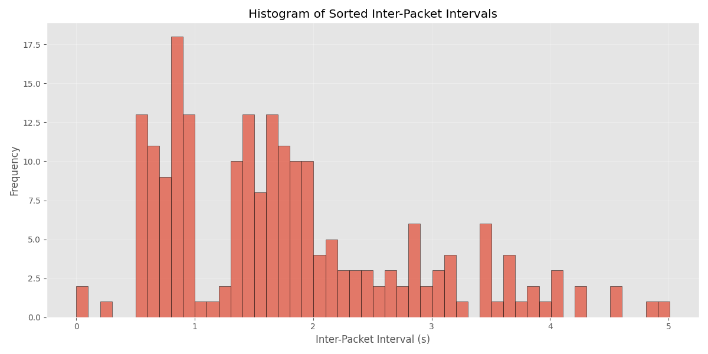
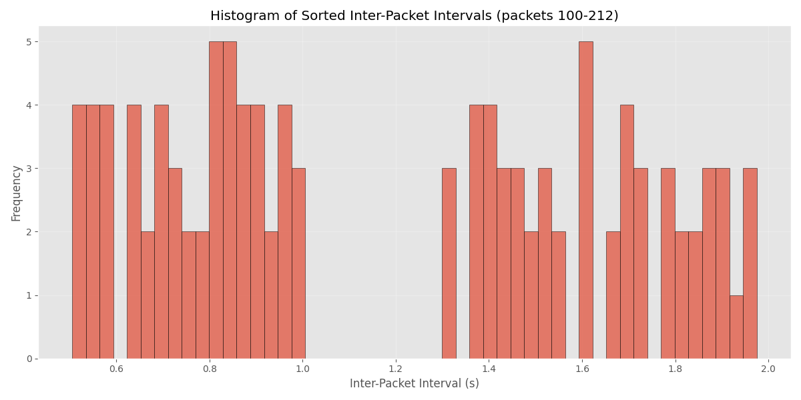

# НИЯУ МИФИ. Лабораторная работа №2. Краснопольский Иван, Б21-525. 2025

## Вариант 7

## Задание 1

### Гистограмма распределения длин межпакетных интервалов



### Вероятность присутствия скрытого канала в системе

```text
Probability of covert channel presence: 0.3889
```

## Задание 2

### Гистограмма распределения длин межпакетных интервалов (начиная с ~100 пакета)



### Вероятность присутствия скрытого канала в системе (начиная с ~100 пакета)

```text
Probability of covert channel presence: 1.0000
```

## Задание 3

### Сообщение, переданное по скрытому каналу связи

> Так как декодирование сообщения прямым способом не удавалось, было сделано предположение, что не передан первый бит,
> равный 0. После этого сообщение было успешно декодировано.

```text
Decoded hidden message: ipds_are_here!
```

### Средство декодирования скрытого сообщения

```python
import numpy as np
import matplotlib.pyplot as plt
from matplotlib import style
import argparse
from pathlib import Path
import dpkt

style.use("ggplot")


def load_packet_timestamps_from_pcapng(file_path: Path) -> np.ndarray:
    timestamps = []

    with open(file_path, "rb") as f:
        pcap_reader = dpkt.pcapng.Reader(f)
        for ts, buf in pcap_reader:
            timestamps.append(ts)

    return np.array(timestamps)


def calculate_ipi(timestamps: np.ndarray) -> np.ndarray:
    sorted_timestamps = np.sort(timestamps)
    ipi = np.diff(sorted_timestamps)
    return ipi


def plot_histogram(ipi: np.ndarray, output: Path, title: str = "Histogram of Inter-Packet Intervals") -> np.ndarray:
    plt.figure(figsize=(12, 6))

    sorted_ipi = np.sort(ipi)

    plt.hist(sorted_ipi, bins=50, edgecolor="black", alpha=0.7)

    plt.title(title)
    plt.xlabel("Inter-Packet Interval (s)")
    plt.ylabel("Frequency")
    plt.grid(True, alpha=0.3)

    plt.tight_layout()

    plt.savefig(output)

    plt.show()

    return sorted_ipi


def calculate_covert_channel_probability(ipi: np.ndarray) -> float:
    hist, bin_edges = np.histogram(ipi, bins=50)

    bin_centers = (bin_edges[:-1] + bin_edges[1:]) / 2
    mean_ipi = np.mean(ipi)

    mean_idx = np.abs(bin_centers - mean_ipi).argmin()
    C_mu = hist[mean_idx]
    C_max = np.max(hist)

    probability = 1.0 - (C_mu / C_max)

    return probability


def decode_hidden_message(ipi: np.ndarray) -> str:
    hist, bin_edges = np.histogram(ipi, bins=50)
    bin_centers = (bin_edges[:-1] + bin_edges[1:]) / 2

    peak_indices = np.argsort(hist)[-2:]
    peak_values = bin_centers[peak_indices]
    peak_values.sort()

    threshold = (peak_values[0] + peak_values[1]) / 2

    bits = ["0"]
    for interval in ipi:
        if interval < threshold:
            bits.append("0")
        else:
            bits.append("1")

    bytes_list = []
    for i in range(0, len(bits), 8):
        if i + 8 <= len(bits):
            byte = "".join(bits[i: i + 8])
            bytes_list.append(byte)

    message = ""
    for byte in bytes_list:
        try:
            char_code = int(byte, 2)
            if 32 <= char_code <= 126:
                message += chr(char_code)
            else:
                message += "?"
        except ValueError:
            pass

    return message


def parse_args() -> argparse.Namespace:
    parser = argparse.ArgumentParser(description="Analysis of inter-packet intervals and covert channel detection")
    parser.add_argument("--input", type=Path, required=True, help="Path to pcapng file")
    parser.add_argument("--output", type=Path, required=True, help="Path to save histogram image")
    parser.add_argument("--start", type=int, help="First packet to analyze (default: all)")
    parser.add_argument("--end", type=int, help="Last packet to analyze (default: all)")

    return parser.parse_args()


def main():
    args = parse_args()

    if not args.input.exists():
        raise FileNotFoundError(f"File not found: {args.input}")

    timestamps = load_packet_timestamps_from_pcapng(args.input)

    start_idx = args.start if args.start is not None else 0
    end_idx = args.end if args.end is not None else len(timestamps)
    timestamps = timestamps[start_idx:end_idx]

    if args.start is not None or args.end is not None:
        title_suffix = f" (packets {start_idx}-{end_idx})"
    else:
        title_suffix = ""

    ipi = calculate_ipi(timestamps)

    title = f"Histogram of Sorted Inter-Packet Intervals{title_suffix}"
    sorted_ipi = plot_histogram(ipi, output=args.output, title=title)

    probability = calculate_covert_channel_probability(sorted_ipi)
    print(f"Probability of covert channel presence: {probability:.4f}")

    message = decode_hidden_message(ipi)
    print(f"Decoded hidden message: {message}")


if __name__ == "__main__":
    main()
```

## Заключение

В ходе лабораторной работы была построена гистограмма отсортированных по возрастанию длин межпакетных интервалов и
определено значение вероятности присутствия скрытого канала в системе согласно формуле:

$$
P = 1 - \lim_{N \to \infty} \frac{C_{\mu}(N)}{C_{max}(N)}
$$

Далее была построена гистограмма отсортированных по возрастанию длин межпакетных интервалов для трафика, в который
включен только промежуток с передачей скрытого сообщения (начиная с ~100 пакета и до последнего пакета в дампе трафика),
а также было определено значение вероятности присутствия скрытого канала в системе.

В итоге было разработано средство декодирования скрытого сообщения и определено, что по скрытому каналу было передано
сообщение `ipds_are_here!`.

В случае малого объема переданной информации в общем объеме трафика распределение межпакетных интервалов приближается к
нормальному, из-за чего определить наличие скрытого канала становится сложнее. В таком случае можно применить анализ
трафика интервалами: $[n; n+\delta],n \in [0; N-\delta]$.

Расширение метода обнаружения на мультисимвольные скрытые каналы на основе изменения длин межпакетных интервалов
возможно через обнаружение аномального трафика (более одного пика на гистограмме) или сравнении эталонного распределения
межпакетных интервалов с полученным.
