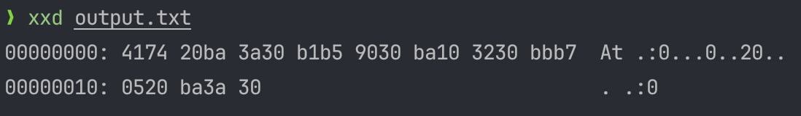
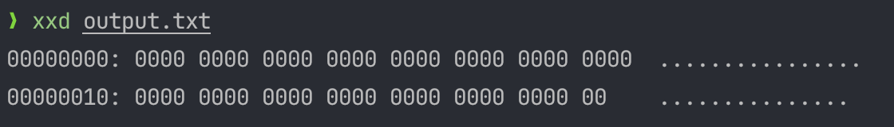

# НИЯУ МИФИ. Лабораторная работа №3. Краснопольский Иван, Б21-525. 2025

## Вариант 8

- Модель штатной передачи информации №4: пакеты случайной длины передаются в случайные моменты времени
- Скрытый канал №8: скрытый канал, основанный на изменении длин межпакетных интервалов
- Возможности закладки: буферизация трафика, генерация фиктивного трафика

## Анализ скрытого канала

Возможности нарушителя:

- Формирование фиктивных пакетов
- Буферизация пакетов
- Добавление временных задержек при отправке пакетов

Таким образом, среди способов построения нарушителем скрытых каналов связи можно выделить следующие:

- Изменение скорости передачи пакетов (К3)
- Изменение длин межпакетных интервалов (К4)

## Снижение пропускной способности скрытого канала

Формула для рассчета пропускной способности:

$$
S = \frac{1}{P_0 \cdot T_0 + P_1 \cdot T_1} \text{бит/секунду}
$$

- $P_0 = P_1 = 0.5$ - вероятность появления бита 0 или 1 (равновероятно)
- $T_0$ - время для передачи бита 0
- $T_1$ - время для передачи бита 1

### Пропускная способность скрытого канала до внедрения устройства защиты

Так как используется скрытый канал, основанный на изменении длин межпакетных интервалов, то его пропускная способность
будет зависеть от выбранных интервалов для 0 и 1. В данной случае выбраны значения $T_0 = 0.5$, $T_1 = 2.0$:

$$
S = \frac{1}{0.5 \cdot 0.5 + 0.5 \cdot 2.0} = 0.8
$$

### Пропускная способность скрытого канала после внедрения устройства защиты

Для снижения пропускной способности способов К3 и К4 был выбран подход генерации фиктивного трафика:

```python
import logging
import random
import socket
import threading
import time

import config

logging.basicConfig(
    level=getattr(logging, config.LOG_LEVEL),
    format=config.LOG_FORMAT,
    datefmt=config.LOG_DATE_FORMAT,
)
logger = logging.getLogger("Filter 1")


def setup_server() -> socket.socket:
    sock = socket.socket(socket.AF_INET, socket.SOCK_STREAM)
    sock.setsockopt(socket.SOL_SOCKET, socket.SO_REUSEADDR, 1)
    sock.bind((config.FILTER_HOST, config.FILTER_PORT))
    sock.listen(5)
    logger.info("Start filter server on %s:%s", config.FILTER_HOST, config.FILTER_PORT)
    return sock


def generate_dummy_packet() -> bytes:
    length = random.randint(config.MIN_PACKET_LENGTH, config.MAX_PACKET_LENGTH)
    packet = "".join(random.choices(config.PACKET_CHARS, k=length))
    return packet.encode()


def forward_packets(producer: socket.socket, consumer: socket.socket):
    while True:
        data = producer.recv(1024)
        if not data:
            break

        logger.info("Forwarding data from proxy: %r", data)

        consumer.sendall(data)


def inject_packets(consumer: socket.socket):
    packet = generate_dummy_packet()
    logger.info("Injecting %s packet", packet)

    consumer.sendall(packet)

    time.sleep(config.MIN_DELAY)


def handle_connection(producer: socket.socket):
    consumer = socket.socket(socket.AF_INET, socket.SOCK_STREAM)
    try:
        consumer.connect((config.CONSUMER_HOST, config.CONSUMER_PORT))

        receiver = threading.Thread(target=forward_packets, args=(producer, consumer), daemon=True)
        injector = threading.Thread(target=inject_packets, args=(consumer,), daemon=True)

        receiver.start()
        injector.start()

        receiver.join()
        injector.join()

    except KeyboardInterrupt:
        logger.info("Connection handler stopped by user")
    except Exception as e:
        logger.error("Error handling connection: %r", e)
    finally:
        producer.close()
        consumer.close()


def start_proxy():
    sock = setup_server()

    try:
        while True:
            producer, addr = sock.accept()
            logger.info("Connection from %r", addr)
            threading.Thread(target=handle_connection, args=(producer,), daemon=True).start()

    except KeyboardInterrupt:
        logger.info("Proxy stopped by user")
    except Exception as e:
        logger.error("Server error: %r", e)
    finally:
        if sock:
            sock.close()


def main():
    start_proxy()


if __name__ == "__main__":
    main()
```

После внедрения устройства защиты, которое отправляет фиктивный пакет каждый определенный интервал времени, пропускная
способность канала значительно снизится, так как потребуется дополнительная передача данных для защиты от созданного
зашумления.

Можно сделать грубую оценку, что как минимум будет необходимо передавать каждый бит дважды для корректирования ошибок, а
также придется продублировать сообщение целиком для восстановления утраченных данных:

$$
S = \frac{1}{(0.5 \cdot 0.5 + 0.5 \cdot 2.0) \cdot 2 \cdot 2} = 0.2
$$

### Оценка влияния на каналы связи

На практике же даже такое вмешательство нарушило работу скрытого канала связи и помешало приемнику корректно
декодировать скрытое сообщение:



На основной канал связи такое усройство защиты оказало минимальное влияние, которое заключается в генерации фиктивных
сообщений и небольшой дополнительной нагрузке на основной канал связи.

## Устранение скрытого канала связи

Для устранения способов К3 и К4 был выбран подход нормализации длин передаваемых пакетов:

```python
import logging
import queue
import random
import socket
import threading
import time

import config

logging.basicConfig(
    level=getattr(logging, config.LOG_LEVEL),
    format=config.LOG_FORMAT,
    datefmt=config.LOG_DATE_FORMAT,
)
logger = logging.getLogger("Filter 2")


def setup_server() -> socket.socket:
    sock = socket.socket(socket.AF_INET, socket.SOCK_STREAM)
    sock.setsockopt(socket.SOL_SOCKET, socket.SO_REUSEADDR, 1)
    sock.bind((config.FILTER_HOST, config.FILTER_PORT))
    sock.listen(5)
    logger.info("Start proxy server on %s:%s", config.FILTER_HOST, config.FILTER_PORT)
    return sock


def generate_dummy_packet() -> bytes:
    length = random.randint(config.MIN_PACKET_LENGTH, config.MAX_PACKET_LENGTH)
    packet = "".join(random.choices(config.PACKET_CHARS, k=length))
    return packet.encode()


def receive_packets(producer: socket.socket, packet_queue: queue.Queue):
    try:
        while True:
            data = producer.recv(1024)
            if not data:
                break

            logger.info("Received data from producer: %r", data)

            try:
                packet_queue.put(data, timeout=1.0)
            except queue.Full:
                logger.warning("Packet buffer full, dropping packet")
    except KeyboardInterrupt:
        logger.info("Packet receiver stopped by user")
    except Exception as e:
        logger.error("Error receiving data: %r", e)


def get_packet_from_queue_or_dummy(packet_queue: queue.Queue) -> bytes:
    try:
        return packet_queue.get_nowait()
    except queue.Empty:
        dummy = generate_dummy_packet()
        logger.info("Generated dummy packet: %r", dummy)
        return dummy


def send_packet(consumer: socket.socket, packet_queue: queue.Queue, elapsed_time: float) -> float:
    data = get_packet_from_queue_or_dummy(packet_queue)

    consumer.sendall(data)
    send_time = time.time()
    logger.info("Sent packet (delay: %.3fs)", elapsed_time)
    return send_time


def is_ready_to_send(elapsed_time: float) -> bool:
    return elapsed_time >= config.NORMAL_DELAY


def send_packets_with_timing(consumer: socket.socket, packet_queue: queue.Queue):
    try:
        data = get_packet_from_queue_or_dummy(packet_queue)
        consumer.sendall(data)
        last_send_time = time.time()

        while True:
            current_time = time.time()
            elapsed_time = current_time - last_send_time

            if is_ready_to_send(elapsed_time):
                last_send_time = send_packet(consumer, packet_queue, elapsed_time)

            time.sleep(0.01)

    except KeyboardInterrupt:
        logger.info("Packet sender stopped by user")
    except Exception as e:
        logger.error("Error sending data: %r", e)


def handle_connection(producer: socket.socket):
    consumer = socket.socket(socket.AF_INET, socket.SOCK_STREAM)
    try:
        consumer.connect((config.CONSUMER_HOST, config.CONSUMER_PORT))
        packet_queue = queue.Queue(maxsize=100)

        receiver = threading.Thread(
            target=receive_packets,
            args=(producer, packet_queue),
            daemon=True,
        )

        sender = threading.Thread(
            target=send_packets_with_timing,
            args=(consumer, packet_queue),
            daemon=True,
        )

        receiver.start()
        sender.start()

        receiver.join()
        sender.join()

    except KeyboardInterrupt:
        logger.info("Connection handler stopped by user")
    except Exception as e:
        logger.error("Error handling connection: %r", e)
    finally:
        producer.close()
        consumer.close()


def start_proxy():
    sock = setup_server()

    try:
        while True:
            producer, addr = sock.accept()
            logger.info("Connection from %r", addr)
            threading.Thread(target=handle_connection, args=(producer,), daemon=True).start()

    except KeyboardInterrupt:
        logger.info("Proxy stopped by user")
    except Exception as e:
        logger.error("Server error: %r", e)
    finally:
        if sock:
            sock.close()


def main():
    start_proxy()


if __name__ == "__main__":
    main()
```

### Оценка влияния на каналы связи

В результате внедрения устройства защиты скрытый канал полностью перестал функционировать:



Основной канал связи также оказался подвержен влиянию, так как теперь интервалы между всеми пакетами нормализованы. В
случае отсутствия пакетов генерируется фиктивный трафик, а если же пакетов слишком много, они буферизируются.

## Заключение

В ходе работы было разработано два устройства защиты: для понижения пропускной способности и для устранения скрытого
канала связи.

Была проведена оценка пропускной способности скрытого канала связи до и после внедрения устройства защиты, а также
оценено влияние устройства защиты в обоих случаях на основной канал связи. В обоих случаях основной канал продолжил
нормальное функционирование, а скрытый канал был поврежден в первом случае и полностью потерял работоспособность во
втором.
